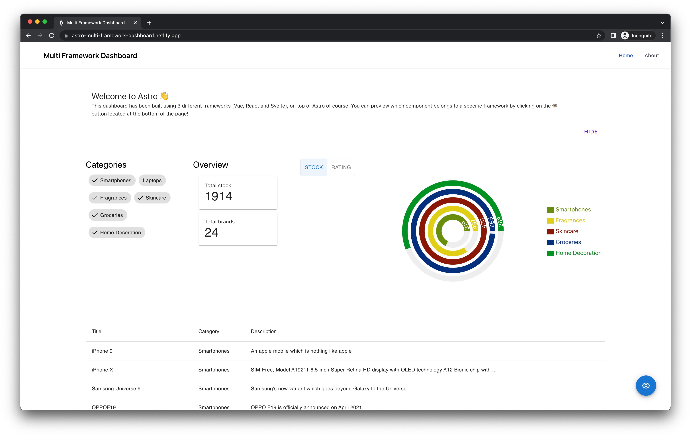
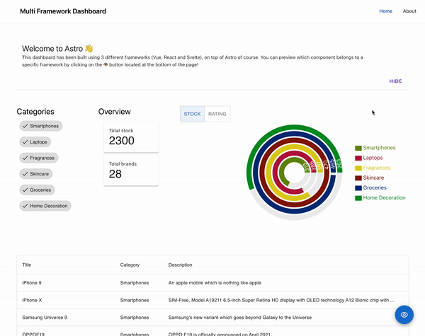
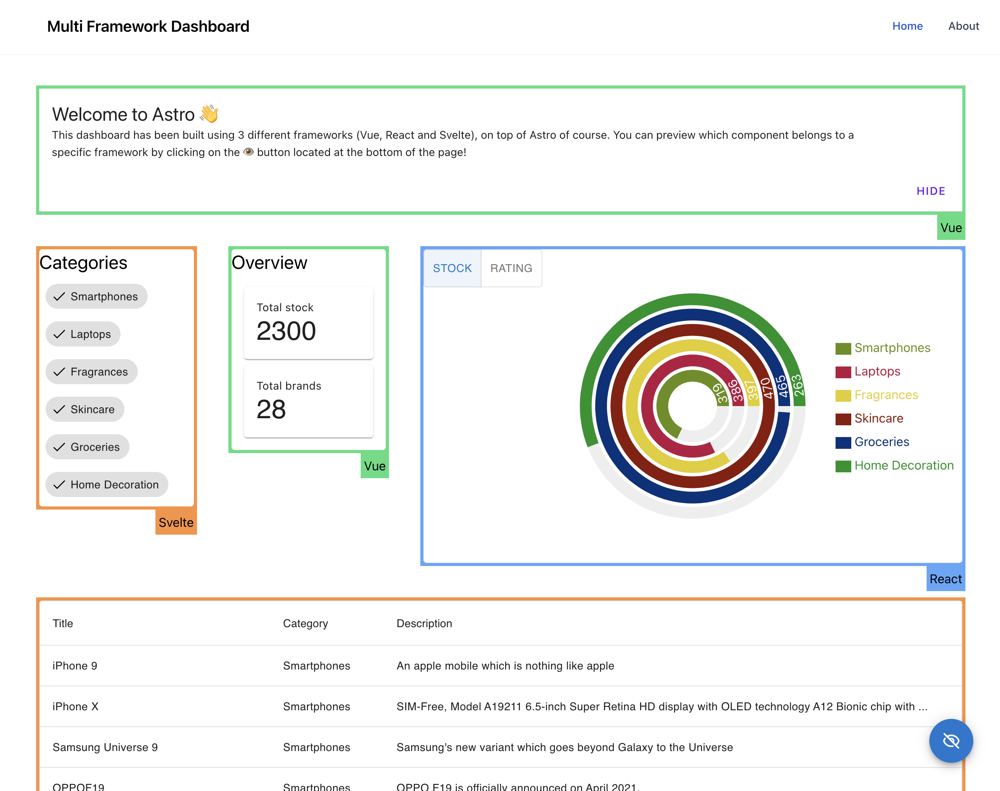
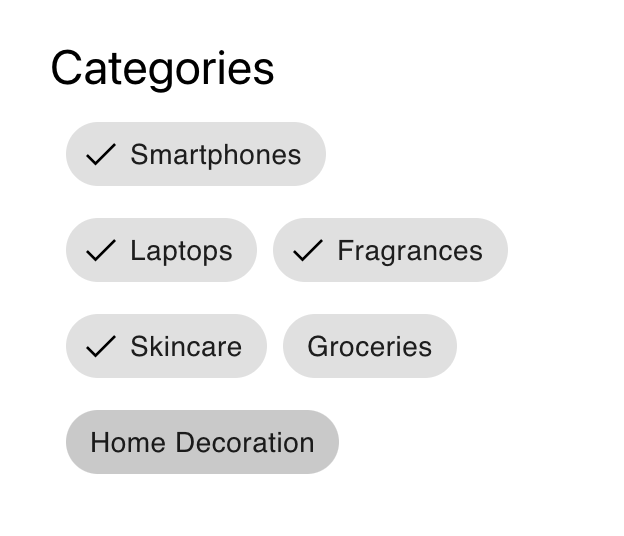
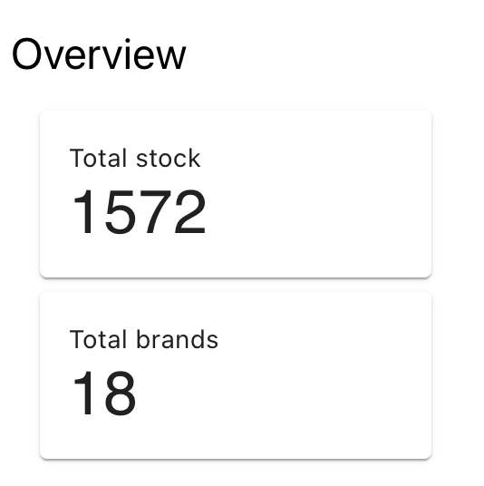
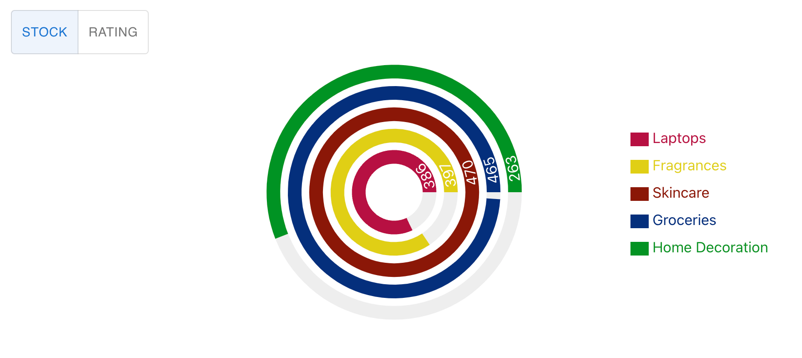

# Building a multi framework Dashboard with Astro

In a previous article, we discussed the architecture behind Astro which makes it possible to build this kind of applications. I highly recommend checking out that article in case you are not familiar with the Islands Architecture: [Understanding Astro islands architecture](https://blog.logrocket.com/understanding-astro-islands-architecture/). In this article, we will be exploring the process of building a website in [Astro](https://astro.build/) using three of the most popular frameworks: React, Svelte, and Vue.js.

Each of these frameworks has its own strengths and weaknesses, and in this article, we will be providing a step-by-step guide on how to build a website using each of them **all together**. This means that I can take the best of each community and put it into the project.

## Project characteristics

For this demo, we are going to use the following libraries to build the dashboard:

- React: [MUI Core](https://mui.com/core/) and [recharts](https://recharts.org/)
- Svelte: [Svelte Material UI](https://sveltematerialui.com/)
- Vue: [Vuetify](https://vuetifyjs.com/en/)

I also installed [Tailwind CSS](https://tailwindcss.com/) to create most of the layout for the page, with the prefix option of `tw-` (this is to prevent clashing classes between [Tailwind and Vuetify](https://github.com/tailwindlabs/tailwindcss/issues/465#issuecomment-388496395))

Our end goal is to build the following dashboard:



Something important to highlight is that all the components are connected between them and the interaction in one, can trigger a change into the other. This is possible by using `nanostores` (we are going to cover it later on the article).



Finally for demo's purposes, I built a _framework highlighter_ to visually displayed the UI framework (React, Vue or Svelte) responsible to render a component. This function can be activated by clicking on the eye icon at the bottom part of the page.



You can also check the application deployed [here](https://astro-multi-framework-dashboard.netlify.app/)

## Setting up a fresh Astro project

The easiest way to create a [new project with Astro](https://docs.astro.build/en/getting-started/), is by using their CLI: `create-astro`. Which comes with maybe one of the friendliest coding assistance ever: Houston!

```sh
# create a new project with npm
> yarn create astro

╭─────╮  Houston:
│ ◠ ◡ ◠  Let's make the web weird!
╰─────╯

 astro   v1.6.15 Launch sequence initiated.

✔ Where would you like to create your new project? … astro-dashboard
✔ How would you like to setup your new project? › a few best practices (recommended)
✔ Template copied!
✔ Would you like to install yarn dependencies? (recommended) … yes
✔ Packages installed!
✔ Would you like to initialize a new git repository? (optional) … yes
✔ Git repository created!
✔ How would you like to setup TypeScript? › Strict
✔ TypeScript settings applied!

  next   Liftoff confirmed. Explore your project!

         Enter your project directory using cd ./astro-dashboard
         Run yarn dev to start the dev server. CTRL+C to stop.
         Add frameworks like react or tailwind using astro add.

         Stuck? Join us at https://astro.build/chat

╭─────╮  Houston:
│ ◠ ◡ ◠  Good luck out there, astronaut!
╰─────╯
```

After that you should end up with folder that looks similar to this structure:

```tree
/astro-dashboard
├── README.md
├── astro.config.mjs
├── output.txt
├── package.json
├── public
|  └── favicon.svg
├── node_modules # sub folders ignored to keep the directory tree short
├── src
|  ├── components
|  |  └── Card.astro
|  ├── env.d.ts
|  ├── layouts
|  |  └── Layout.astro
|  └── pages
|     └── index.astro
├── tsconfig.json
└── yarn.lock
```

Let's start our development server, by running:

```bash
> yarn dev

yarn run v1.22.19
$ astro dev
  🚀  astro  v1.6.15 started in 57ms

  ┃ Local    http://127.0.0.1:3000/
  ┃ Network  use --host to expose
```

By opening the `localhost` URL, you should see the following screen in your browser:


## Adding the UI frameworks

The official Astro documentation has a summary of all their [official integrations](https://docs.astro.build/en/guides/integrations-guide/#official-integrations), covering the topics of: **UI Frameworks**, SSR Adapters and others (such as **Tailwind**).

Similar to previous scenario, the Astro team made it simple for everybody and shipped the command `astro add`, which we can use to install any of the **official integrations**. This command is already available in our fresh project, so we need to simply execute:

```bash
> yarn astro add react vue svelte tailwind

✔ Resolving packages...

  Astro will run the following command:
  If you skip this step, you can always run it yourself later

╭─────────────────────────────────────────────────────────────────────────────────────────────────────╮
│ yarn add @astrojs/react @astrojs/svelte @astrojs/tailwind @astrojs/vue @types/react-dom@^18.0.6     │
│ @types/react@^18.0.21 react-dom@^18.0.0 react@^18.0.0 svelte@^3.46.4 tailwindcss@^3.0.24            │
│ vue@^3.2.30                                                                                         │
╰─────────────────────────────────────────────────────────────────────────────────────────────────────╯

✔ Continue? … yes
✔ Installing dependencies...

  Astro will generate a minimal ./tailwind.config.cjs file.

✔ Continue? … yes

  Astro will make the following changes to your config file:

 ╭ astro.config.mjs ───────────────────────────────────────╮
 │ import { defineConfig } from 'astro/config';            │
 │                                                         │
 │ // https://astro.build/config                           │
 │ import react from "@astrojs/react";                     │
 │ import vue from "@astrojs/vue";                         │
 │ import svelte from "@astrojs/svelte";                   │
 │ import tailwind from "@astrojs/tailwind";               │
 │                                                         │
 │ // https://astro.build/config                           │
 │ export default defineConfig({                           │
 │   integrations: [react(), vue(), svelte(), tailwind()]  │
 │ });                                                     │
 ╰─────────────────────────────────────────────────────────╯

✔ Continue? … yes

   success  Added the following integrations to your project:
  - @astrojs/react
  - @astrojs/vue
  - @astrojs/svelte
  - @astrojs/tailwind

  Astro will make the following changes to your tsconfig.json:

 ╭ tsconfig.json ──────────────────────────╮
 │ {                                       │
 │   "extends": "astro/tsconfigs/strict",  │
 │   "compilerOptions": {                  │
 │     "jsx": "react-jsx",                 │
 │     "jsxImportSource": "react"          │
 │   }                                     │
 │ }                                       │
 ╰─────────────────────────────────────────╯

✔ Continue? … yes

   success  Successfully updated TypeScript settings
```

As you can see, Astro took over all the manual tasks of installing the integrations, adding them into our Astro configuration file and even update our `tsconfig.json` to make React work nicely with Typescript. Great job Houston!

## Setting up our Layout

Let's start by setting up our `Layout` for the page, which consists of a `Header`, `Footer`, and the container for our page content. In order to avoid several changes when we introduce vuetify is better to change the `prefix` inside our `tailwind.config.cjs` file.

```diff
# tailwind.config.cjs
/** @type {import('tailwindcss').Config} */
module.exports = {
  content: ['./src/**/*.{astro,html,js,jsx,md,mdx,svelte,ts,tsx,vue}'],
  theme: {
    extend: {},
  },
  plugins: [],
+  prefix: 'tw-',
};
```

Let's apply the modification to our `Layout`:

```jsx
// src/layouts/Layout.astro
---
type Props = {
  title: string;
};

const { title } = Astro.props;
---

<!DOCTYPE html>
<html lang="en">
  <head>
    <meta charset="UTF-8" />
    <meta name="viewport" content="width=device-width" />
    <link rel="icon" type="image/svg+xml" href="/favicon.svg" />
    <meta name="generator" content={Astro.generator} />
    <title>{title}</title>
  </head>
  <body>
    <div class="tw-flex tw-h-screen tw-overflow-hidden">
      <main
        class="tw-relative tw-bg-white tw-flex tw-flex-col tw-flex-1 tw-overflow-y-auto tw-overflow-x-hidden"
      >
        <!-- Header -->
        <nav class="tw-bg-white tw-shadow-sm tw-px-2 sm:tw-px-4 tw-py-2.5">
          <div
            class="container tw-flex tw-flex-wrap tw-justify-between tw-items-center tw-mx-auto"
          >
            <a href="/" class="tw-flex tw-items-center">
              
              <span
                class="tw-self-center tw-text-xl tw-font-semibold tw-whitespace-nowrap"
                >{title}
              </span>
            </a>
          </div>
        </nav>

        <!-- Content container -->
        <div class="tw-container tw-mx-auto tw-my-10 tw-flex-grow">
          <slot />
        </div>

        <!-- Footer -->
        <footer
          class="tw-p-4 tw-bg-white tw-rounded-lg tw-shadow md:tw-flex md:tw-items-center md:tw-justify-between md:tw-p-6"
        >
          <span class="tw-text-sm tw-text-gray-500 sm:tw-text-center">
            Built with
            <a href="https://astro.build/" class="hover:tw-underline">Astro</a>
          </span>
        </footer>
      </main>
    </div>
  </body>
</html>
```

Without making any changes into our initial page (`src/pages/index.astro`) and applying these changes, you should see the following screen:


## Fetching the dashboard data

For the purpose of this demo, I decided to use [`https://dummyjson.com/`](https://dummyjson.com/) which provides several public REST APIs that we can use to simulate a real scenario of getting data from our servers in the future. To be more specific I used the [Products list endpoint](https://dummyjson.com/docs/products).

When we call the API, the output has the following structure:

```json
{
  "products": [
    {
      "id": 1,
      "title": "iPhone 9",
      "description": "An apple mobile which is nothing like apple",
      "price": 549,
      "discountPercentage": 12.96,
      "rating": 4.69,
      "stock": 94,
      "brand": "Apple",
      "category": "smartphones",
      "thumbnail": "...",
      "images": ["...", "...", "..."]
    },
    {...},
    {...},
    {...}
    // 30 items
  ],

  "total": 100,
  "skip": 0,
  "limit": 30
}
```

Given that we are working in a Typescript project, it's always recommended to type our API responses. For that, we can have the following type for this response:

```ts
// src/types.ts
export type Product = {
  id: number;
  title: string;
  description: string;
  price: number;
  discountPercentage: number;
  rating: number;
  stock: number;
  brand: string;
  category: string;
  thumbnail: string;
};
```

In order to fetch data using Astro, we can simply use the `fetch` function and it will call the endpoint before rendering our component, with the benefit that we don't need to handle loading states in our application. This way of loading data the one for _Static sites_, where the endpoints are being called on build time. At the same time, Astro also supports [Server-side rendering](https://docs.astro.build/en/guides/server-side-rendering/#enabling-ssr-in-your-project). It's always important to understand what kind of application is better to implement given your needs.

Given that the data source that we are going to use can be considered _static_ (the list of products doesn't change over the time), running our queries is the best fit to improve the performance and UX of the application. Let's make the following modification into our initial page.

```diff
// src/pages/index.astro
---
import Layout from '../layouts/Layout.astro';
import Card from '../components/Card.astro';
+ import type { Product } from '../types';

// fetch data
+ const products: Product[] = await fetch('https://dummyjson.com/products')
+   .then((res) => res.json())
+   .then((res) => res.products);
---

<Layout title="Welcome to Astro.">
  <main>
    <h1>Welcome to <span class="text-gradient">Astro</span></h1>
```

## Svelte integration: Categories + Table

When checking the code for the main page, you will find the power of the composition of several frameworks into one Astro component, and the real usage of _client directives_.

I also used [Tailwind CSS](https://tailwindcss.com/) to set up most of the layout of the page, that's why some additional classes are starting with `tw-`.

```jsx
// src/pages/index.astro
---
import type { Product } from 'types';

// Astro
import Layout from 'layouts/Layout.astro';

// React
import { HighlighterWrapper, HighlighterToggle } from 'components/Highlighter';
import CategoryChart from 'components/CategoryChart';

// Svelte
import Tags from 'components/Tags.svelte';
import ProductTable from 'components/ProductTable.svelte';

// Vue
import Banner from 'components/Banner.vue';
import Overview from 'components/Overview.vue';

// fetch data
const products = await fetch('https://dummyjson.com/products')
  .then((res) => res.json())
  .then((res) => res.products as Product[]);
---

<Layout page="Home">
  <div class="tw-grid tw-grid-cols-1 tw-gap-4 md:tw-grid-cols-5 md:tw-gap-10">
    <HighlighterWrapper
      client:idle
      framework="vue"
      className="tw-col-span-full"
    >
      <Banner client:load />
    </HighlighterWrapper>

    <HighlighterWrapper client:idle framework="svelte">
      <Tags client:load products={products} />
    </HighlighterWrapper>

    <HighlighterWrapper client:idle framework="vue">
      <Overview client:load products={products} />
    </HighlighterWrapper>

    <HighlighterWrapper client:idle framework="react" className="tw-col-span-3">
      <CategoryChart client:only="react" products={products} />
    </HighlighterWrapper>

    <HighlighterWrapper
      client:idle
      framework="svelte"
      className="tw-col-span-full"
    >
      <ProductTable client:load products={products} />
    </HighlighterWrapper>
  </div>

  <HighlighterToggle client:visible />
</Layout>
```

Let's understand what's going on here:

1. There are several imports some of them importing `Typescript` types, Astro components, React, Vue, and lastly Svelte components.
2. We are calling the API of `https://dummyjson.com/products` to get the list of `Product`. Astro will first resolve the promise, and later on pass into the next step: rendering.
3. On rendering we can see that all the components imported from above are treated in the same way and the API to render them also stays the same. We are passing down the information about the products that we previously fetched.

| Remember that to make our components interactive, we **have to** set manually the _client directives_, by using the `client:` property as props of the components.

A big to issue to face when having a cross-framework codebase is **state management**: How do we share information between my components, given that each library has different ways of achieving that:

- React has the [Context API](https://reactjs.org/docs/context.html), with a `Provider` / `Consumer` pattern.
- Vue provides a [reactive API](https://vuejs.org/guide/scaling-up/state-management.html#simple-state-management-with-reactivity-api), following the conventions of `Actions --> State --> View` (similar style to Redux).
- Svelte recommends using [Stores](https://svelte.dev/docs#run-time-svelte-store), providing `readable`, `writable`, and `derived` containers.

Besides, all these are valid ways of fixing the state management issue, it's clear that we need to find a common solution that works for all the UI libraries. This is where [`nanostores`](https://github.com/nanostores/nanostores) comes into play! The description they provided in their GitHub page is simply perfect:

> A tiny state manager for React, React Native, Preact, Vue, Svelte, and vanilla JS. It uses many atomic stores and direct manipulation.

The API is simple as:

```js
import { atom } from 'nanostores';

// definition of state for primitive values
export const counter = atom(0);

// read and write state
counter.set(counter.get() + 1);

// definition of state for objects
export const car = map({
  brand: 'Tesla',
  km: 0,
});

// update property inside object
car.setKey('km', car.get().km + 1000);
```

The library provides more APIs to have more control over the state updates and notifications, so I highly recommend checking their documentation in case you will like to dig deeper. Nevertheless, an important part to cover is the integration with the different UI Libraries.

For each framework they provide a separate package that will also follow the coding standard of it:

- React([`@nanostores/react`](https://github.com/nanostores/react)): provides `useStore()` hook to get the store’s value and re-render the component on store’s changes.
- Vue([`@nanostores/vue`](https://github.com/nanostores/vue)) `useStore()` composable function to get store’s value and re-render component on store’s changes.
- Svelte: `nanostores` implements Svelte's store contract, we just need to put `$` before the store variable to get the value and subscribe for changes.

With all that in mind, we can have a centralized place where all our components share information. In the case of this dashboard, I built the feature that allows the user to show/hide Categories, by clicking on the _Pills_ (written in Svelte) components. This change should also be reflected inside:

- Overview Cards (written in Vue)
- Stock/Rating chart (written in React)
- Products Table (written in Svelte)

This is a demo of how it looks!

<div class="Image__Large">
  
  <figcaption>Dashboard interaction</figcaption>
</div>

To start, we should look at the definition of `nanostores`. I use a simple `atom` holding the list of _hidden_ categories.

```js
import { atom } from 'nanostores';

export const hiddenCategories = atom<string[]>([]);
```

I also wrote a helper file for all the product value calculations, they are going to be used across the following components, and it can be also considered a way to share logic between your cross-platform application.

```ts
// utils/product.ts
import type { Product } from 'types';

export const groupByCategory = (
  products: Product[],
): Record<string, Product[]> => {
  return products.reduce((acc, curr) => {
    const existingCategory = acc[curr.category];

    acc[curr.category] = existingCategory
      ? existingCategory.concat(curr)
      : [curr];
    return acc;
  }, {} as Record<string, Product[]>);
};

export const getCategories = (products: Product[]): string[] => {
  const categoriesMap = products.reduce((acc, curr) => {
    acc[curr.category] = true;
    return acc;
  }, {} as Record<string, boolean>);

  return Object.keys(categoriesMap);
};

export const getTotalStock = (products: Product[]) => {
  return products.reduce((acc, curr) => acc + curr.stock, 0);
};

export const getRating = (products: Product[]) => {
  const avg =
    products.reduce((acc, curr) => acc + curr.rating, 0) / products.length;
  return Math.round(avg * 100) / 100;
};

export const getBrands = (products: Product[]) => {
  const brandsMap = products.reduce((acc, curr) => {
    acc[curr.brand] = true;
    return acc;
  }, {} as Record<string, boolean>);

  return Object.keys(brandsMap);
};
```

Let's take a look at the `Tags` component, written in Svelte. This component holds the internal value of the selected categories and displays them using [`Chip`](https://sveltematerialui.com/demo/chips/). Finally, it updates the store after the user clicks on it with the unselected categories.

<div class="Image__Small">
  
  <figcaption>Tags component</figcaption>
</div>

```ts
// 'components/Tags.svelte';
<script lang="ts">
  import Chip, { Set, Text } from '@smui/chips';
  import type { Product } from 'types';

  import { getCategories } from 'utils/product';
  import { humanize } from 'utils/string';
  import { hiddenCategories } from 'utils/state';

  // 1. Props definitions
  export let products: Product[];

  // 2. Definition of categories
  const categories = getCategories(products);

  // 3. Definition of local state for all the selected categories.
  // At the beginning all the categories are selected
  let selected: string[] = Array.from(categories);

  // 4. Update handler + store update
  function updateSelection() {
    hiddenCategories.set(
      categories.filter((category) => !selected.includes(category)),
    );
  }
</script>

<h1>Categories</h1>

<Set
  chips={categories}
  let:chip
  filter
  bind:selected
  on:click={updateSelection}
>
  <Chip {chip} touch>
    <Text>{humanize(chip)}</Text>
  </Chip>
</Set>
```

Then we have the Overview cards, written in Vue. It reads the value from the store and based on the categories calculated the value for _Total Stock_ and _Total Brands_, using some of the helpers from `product`, and displays them using [`v-card`](https://mui.com/material-ui/react-toggle-button/).

<div class="Image__Small">
  
  <figcaption>Overview cards</figcaption>
</div>

```ts
// components/Overview.vue
<script setup lang="ts">
import { useStore } from '@nanostores/vue';
import type { Product } from 'types';

import { hiddenCategories } from 'utils/state';
import { getBrands, getTotalStock } from 'utils/product';

type Props = {
  products: Product[];
};
// 1. Props definition
const props = defineProps<Props>();

// 2. Reading the value from the store
const $hiddenCategories = useStore(hiddenCategories);
</script>

<template>
  <h1>Overview</h1>

  <v-container>
    <v-row dense>
      <v-col cols="12">
        <v-card>
          <v-card-text>
            <div>Total stock</div>
            <p class="text-h4 text--primary">
              <!-- Calculating stock with value from store -->
              {{
                getTotalStock(
                  props.products.filter(
                    (product) => !$hiddenCategories.includes(product.category),
                  ),
                )
              }}
            </p>
          </v-card-text>
        </v-card>
      </v-col>

      <v-col cols="12">
        <v-card>
          <v-card-text>
            <div>Total brands</div>
            <p class="text-h4 text--primary">
              <!-- Calculating brand amount with value from store -->
              {{
                getBrands(
                  props.products.filter(
                    (product) => !$hiddenCategories.includes(product.category),
                  ),
                ).length
              }}
            </p>
          </v-card-text>
        </v-card>
      </v-col>
    </v-row>
  </v-container>
</template>
```

Next, we have the Category Radial Graph, written in React.js. This component reads the value of the store, and based on the selected Item of the [`ToggleButton`](https://mui.com/material-ui/react-toggle-button/) it calculates the _Total Stock_ or the _Rating average_ by Category and passes it down to the [`RadialBarChart`](https://recharts.org/en-US/api/RadialBarChart).

<div class="Image__Medium">
  
  <figcaption>Category Radial Graph</figcaption>
</div>

```tsx
import { useStore } from '@nanostores/react';
import React from 'react';
import {
  RadialBarChart,
  RadialBar,
  Legend,
  ResponsiveContainer,
} from 'recharts';
import type { Product } from 'types';
import {
  getCategories,
  getTotalStock,
  groupByCategory,
  getRating,
} from 'utils/product';
import { hiddenCategories } from 'utils/state';
import randomColor from 'randomcolor';
import { humanize } from 'utils/string';
import ToggleButtonGroup from '@mui/material/ToggleButtonGroup';
import ToggleButton from '@mui/material/ToggleButton';

const style = {
  top: '50%',
  right: 0,
  transform: 'translate(0, -50%)',
  lineHeight: '30px',
};

type Props = {
  products: Product[];
};

type View = 'stock' | 'rating';

const CategoryChart = (props: Props) => {
  // 1. State to know which view to show: Stock or Rating average
  const [view, setView] = React.useState<View>('stock');

  // 2. Read value from the store
  const disabledCategories = useStore(hiddenCategories);

  const categories = getCategories(props.products);
  const groupedByCategory = groupByCategory(props.products);

  // 3. Generate data for the graph based on the store
  const data = categories
    .filter((category) => !disabledCategories.includes(category))
    .map((category) => ({
      name: humanize(category),
      stock: getTotalStock(groupedByCategory[category]!),
      rating: getRating(groupedByCategory[category]!),
      fill: randomColor({ seed: category, luminosity: 'dark' }),
    }));

  return (
    <>
      <div style={{ width: '100%', height: 400, position: 'relative' }}>
        <ResponsiveContainer width="100%" height="100%">
          <RadialBarChart
            cx="50%"
            cy="50%"
            innerRadius="20%"
            outerRadius="80%"
            barSize={15}
            data={data}
          >
            <RadialBar
              minAngle={15}
              label={{ position: 'insideStart', fill: '#fff' }}
              background
              {/* 4. dataKey defines which property the graph is going to use for the RadialBar */}
              dataKey={view}
            />

            <Legend
              iconSize={20}
              layout="vertical"
              verticalAlign="middle"
              wrapperStyle={style}
            />
          </RadialBarChart>
        </ResponsiveContainer>

        <ToggleButtonGroup
          style={{ position: 'absolute', top: 0 }}
          color="primary"
          value={view}
          exclusive
          {/* 5. Change between different view mode */}
          onChange={(_, val) => val && setView(val)}
        >
          <ToggleButton value="stock">Stock</ToggleButton>
          <ToggleButton value="rating">Rating</ToggleButton>
        </ToggleButtonGroup>
      </div>
    </>
  );
};

export default CategoryChart;
```

Finally, we have the Product Table, written in Svelte. This component reads the value from the store, and filters the list of `Product` to be displayed inside the Table.

<div class="Image__Medium">
  
  <figcaption>Product Table</figcaption>
</div>

```ts
<script lang="ts">
  import DataTable, { Head, Body, Row, Cell } from '@smui/data-table';
  import type { Product } from 'types';

  import { hiddenCategories } from 'utils/state';
  import { humanize } from 'utils/string';

  // 1. Received products from props
  export let products: Product[];
</script>

<DataTable style="width: 100%;">
  <Head>
    <Row>
      <Cell style="width: 100%;">Title</Cell>
      <Cell>Category</Cell>
      <Cell>Description</Cell>
      <Cell>Price</Cell>
      <Cell>Stock</Cell>
    </Row>
  </Head>
  <Body>
    // 2. Read value from the store using $, filter the products, and create a Row with each item inside the list
    {#each products.filter((product) => !$hiddenCategories.includes(product.category)) as item (item.id)}
      <Row>
        <Cell>{item.title}</Cell>
        <Cell>{humanize(item.category)}</Cell>
        <Cell>{item.description}</Cell>
        <Cell numeric>{item.price}</Cell>
        <Cell numeric>{item.stock}</Cell>
      </Row>
    {/each}
  </Body>
</DataTable>
```

With this, we covered the main logic of the dashboard. Nevertheless, there are some configuration files and additional helpers that are used as well, but to keep this article as short as possible I decided to not include them. You can find all the code of the dashboard available on [Github](https://github.com/EmaSuriano/astro-multi-framework-dashboard). Feel free to fork the project, and play around with the different combinations of components in the framework.

## Last words

I see Astro.js as a new fresh framework to build a website with the power to ship super-light websites using zero Javascript code or even add the UI libraries that you want to create a unique user-experience. The main idea of building a dashboard using several UI libraries was to showcase the flexibility of Astro and its plugin system. Adding one or even two UI libraries into a project increases the complexity of it sustainably because it requires that each developer in the team should know how to read, understand and modify the code written in completely different syntaxes.

Nevertheless, I do think this is an incredible idea for codebase migration! Let's say that you have an application written in Vue.js, and you would like to migrate it into React. The migrations steps would like:

1. Create an Astro project, and install the plugin of [`@astro/vue`](https://docs.astro.build/en/guides/integrations-guide/vue/) and [`@astro/react`](https://docs.astro.build/en/guides/integrations-guide/react/).
2. Create individual files for all the routes of your Vue.js application.
3. Add the components using the different _client directives_ to make them interactive.
4. Now you can start replacing each `.vue` component with `.tsx` or `.jsx`, converting the Vue syntax into React code.
5. Once you replaced all your `.vue` files, you can safely remove `@astro/vue` from your Astro config file.

Thanks for reading and let's keep building stuff together! 👷‍♂️

### References

- [Astro docs](https://astro.build/)
- [Islands Architecture](https://jasonformat.com/islands-architecture/)
- [Multi Framework Dashboard - Github Repository](https://github.com/EmaSuriano/astro-multi-framework-dashboard)
- [Multi Framework Dashboard - Demo](https://astro-multi-framework-dashboard.netlify.app/)
- [nanostores - Github Repository](https://github.com/nanostores/nanostores)
- [MUI docs](https://mui.com/)
- [Vuetify docs](https://next.vuetifyjs.com/en/)
- [SMUI docs](https://sveltematerialui.com/demo/chips/)
