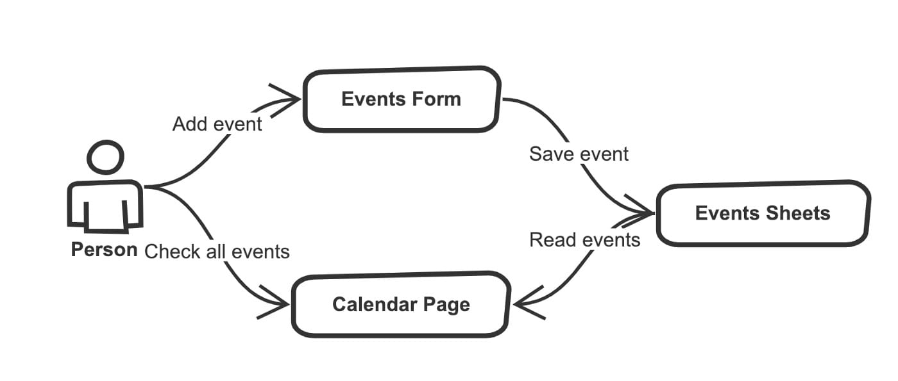
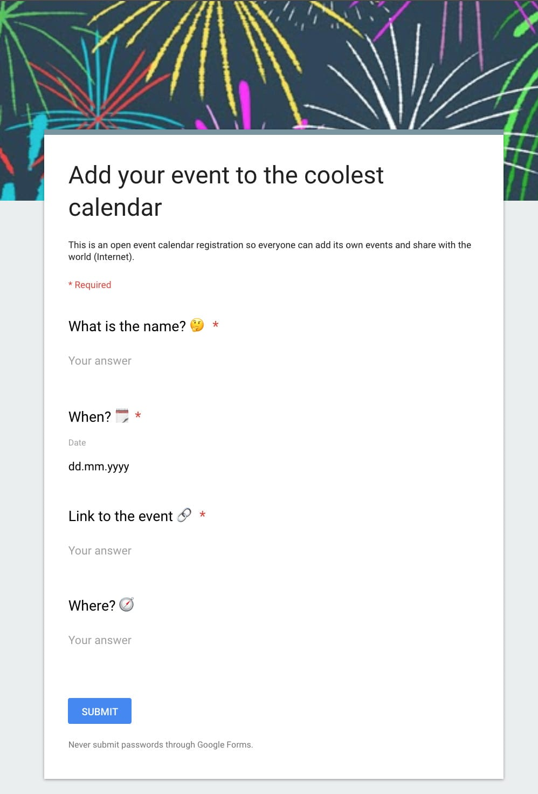
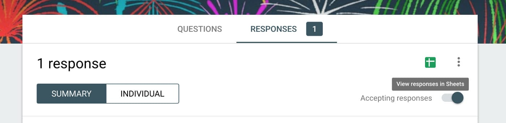
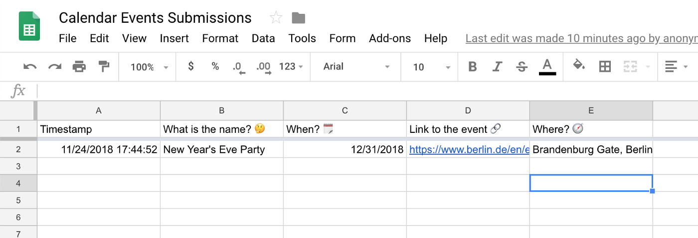
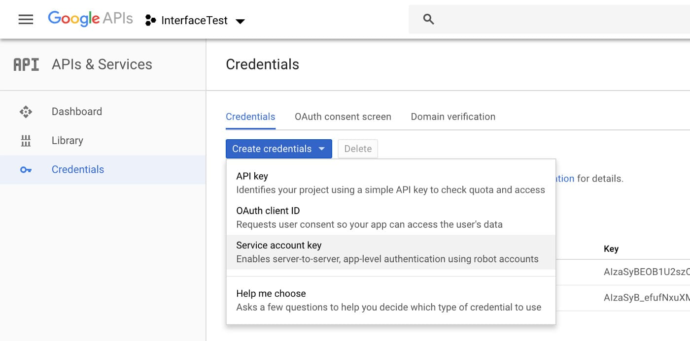
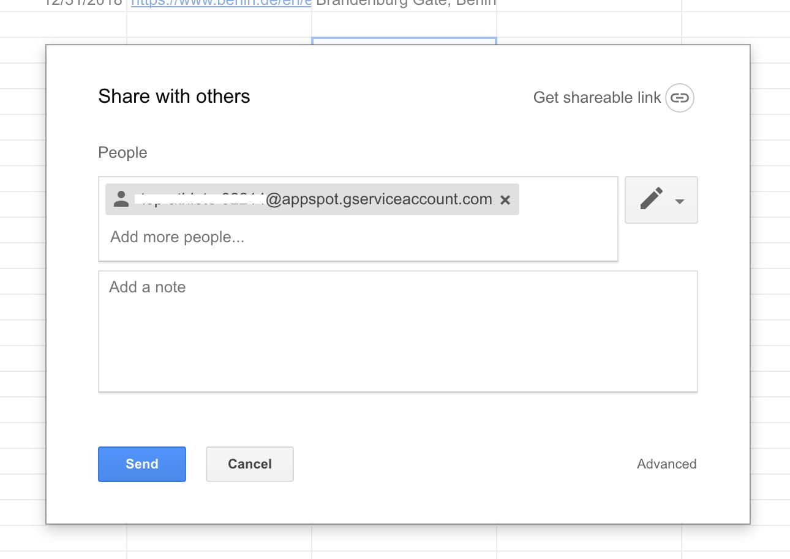
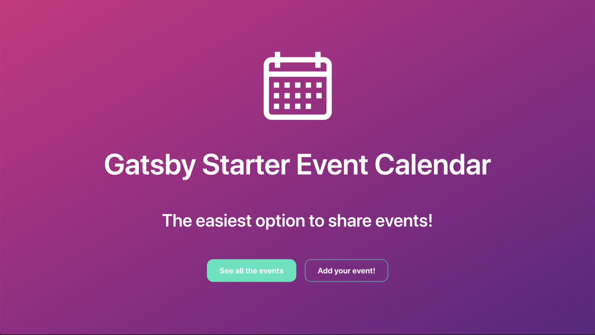
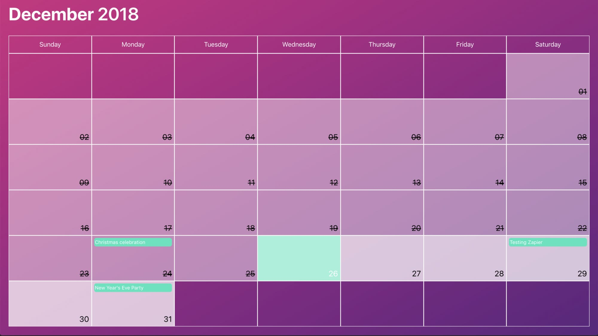

About one week ago a friend of mine came to me for help, he wanted to create an online calendar for cultural events around the city. The idea was to create an application with a calendar showing all the upcoming events with the possibility that any person can add or edit new events.

So in summary, the application needs to have the following features:

- Display a calendar with events and information about them.

- Read the events from somewhere.

- Provide a way to add new events.

## Breaking down the Challenge 👷‍♂️

If we translate these requirements to technical points, I listed the following requirements:

- **Storage**: Have a database to store the events

- **Backend:** Provide an _API_ to read/write from/to the database.

- **Frontend:** A web app with two pages, one to add the events and another with a calendar to display the events.

Seems like a lot of work right? But what if I only focus on the frontend and delegate the backend and storage? Now it doesn’t seem that long!

Most probably you heard about [Google Forms](https://www.google.com/intl/en/forms/about/) and [Google Sheets](https://www.google.com/intl/en/sheets/about/)? Let me tell you that they work amazing as **Backend** and **Storage** 😄 This is how it works:

- Google Forms provides the page to add and edit events to the calendar. The only thing you need to do is ask the proper questions.

- Google Forms has a hidden feature to save your results inside a Google Spreadsheet, so each answer will be mapped into a row inside of a table.

- Google has made an excellent job by providing APIs for all their products (you just have to enable it), therefore now we can read the rows from the spreadsheets from our application.

- The missing part is the Frontend, I used [Gatsby](https://www.gatsbyjs.org/) to create the website with the calendar because of its great [Source Plugin](https://www.gatsbyjs.org/tutorial/part-five/) system, allowing me to access the events information very easily.

I made a simple diagram to show the interaction between the different parts. Hope it’s clear now 😅

<div class="Image__Medium">
  
  <figcaption>Communication Diagram</figcaption>
</div>

## Setting the Form 📝

Pretty straight forward, create [a new Google Form](http://forms.new/) asking all the questions regarding your events. Most probably you want to ask for the name, when, where, etc.

[Here](https://docs.google.com/forms/d/e/1FAIpQLSeUNNgqdhcPlTaVqLb_NceeBd_XVTEBxGwr66wSUbFRArPo3A/viewform) is the link to the form I created in case you want to check how I structure the questions.

<div class="Image__Small">
  
  <figcaption>Add event Form</figcaption>
</div>

## Saving answers inside a Spreadsheet 💾

Inside the _Edit Mode_ of the Form, select the **Responses** and click on the green Spreadsheet icon that says “_View responses in Sheets_”.

<div class="Image__Medium">
  
  <figcaption>Location of “View responses in Sheets” button</figcaption>
</div>

This will automatically create a Spreadsheet for you linking each answer of the form to a column. And of course, every time someone adds a new event the spreadsheet will be updated too ✨

<div class="Image__Medium">
  
  <figcaption>Auto-generated spreadsheet</figcaption>
</div>

## Enabling Google API to read from the spreadsheet

This step could be tricky the first time you do it, but like the others is super simple too. Navigate to your [Google API Dashboard](https://console.developers.google.com/) and open the **Credentials** located in the left panel. There click on “_Create credentials_” and select “_Service account key_”.

<div class="Image__Medium">
  
  <figcaption>Creating a Service account key</figcaption>
</div>

You’ll be redirected to a new page to create the service account key, make sure the option of “_App Engine default service account_” is selected and the _key type_ marked as **JSON**. Click on Create and you will receive a JSON file with a lot of fields, for the moment store it somewhere on your computer because we are going to use more than once.

Inside the JSON object, look for the key `client_email` and copy the value of it which should be a valid email address. Open the Spreadsheet generated by Google Forms, click on the **Share** button located at the top right corner, and add the mail. This is how you enable to read the document from an external application 🎉

<div class="Image__Medium">
  
  <figcaption>Share spreadsheet Form</figcaption>
</div>

## Displaying the events within a calendar 🗓

Once we stored all the events inside the Spreadsheet and have a way to retrieve them, it’s time to add a proper UI which means a beautiful Calendar!

I created a Gatsby starter with a 1-minute setup that connects the application with your spreadsheet and renders all the events inside a calendar. You can find the repository [here](https://github.com/EmaSuriano/gatsby-starter-event-calendar).

In order to bootstrap the project, I recommend using the `new` command from Gatbsy, which will create a new folder, copy all the code from the repository and install all the dependencies.

```bash
> gatsby new event-calendar https://github.com/EmaSuriano/gatsby-starter-event-calendar
```

Remember the _JSON_ file you downloaded before? Now it’s time to use it! Create a new called `.env` in the root of the project with the following information from your config file.

```env
PRIVATE_KEY= // value of private_key
PRIVATE_KEY_ID= // value of private_key_id
PROJECT_ID= // value of project_id
```

The project is going to read all these credentials and grant access to access the information inside your Spreadsheet. This file is excluded inside the `.gitignore`, therefore it would never be published.

After this open `gatsby-config.js` and look for options of `gatsby-source-google-sheets`, and change the values of:

- `spreadsheetId`: you can find this value at the ending of the Spreadsheet URL. `https://docs.google.com/spreadsheets/d/[spreadsheetId]`
- `worksheetTitle`: this is the name of the sheet from which you want to read the information.

Finally, you need to map your columns of the spreadsheet to the data structure that the calendar is expecting. I highly suggest running your queries inside [http://localhost:8000/\_\_\_graphql](http://localhost:8000/___graphql), which is the GraphQL playground where you can write your queries and get the result immediately.

In my case, I have to write the following query:

```graphql
query eventsQuery {
  allGoogleSheetEventsRow {
    edges {
      node {
        id
        eventName: whatisthename
        date: when
        place: where
        eventLink: linktotheevent
      }
    }
  }
}
```

Now you are ready to run the project, fetching all the events inside your Spreadsheet and display them inside beautiful Calendars!️ Execute the following command inside your terminal:

```bash
> yarn start
```

This command will trigger `gatsby develop` that will run all the Static Queries inside the project and host your application inside [http://localhost:8000/](http://localhost:8000/). If you open it inside your browser you should see this Home page:

<div class="Image__Medium">
  
  <figcaption>Event Calendar Starter — Home</figcaption>
</div>

And if you scroll just a little bit or click on **See all the events** button, you should be able to see all the Calendars filled with the information of your events 🎉

<div class="Image__Medium">
  
  <figcaption>Event Calendar Starter — Calendar view</figcaption>
</div>

In case you want to know more about [Event Calendar Starter](https://github.com/EmaSuriano/gatsby-starter-event-calendar), I recommend you to check the documentation that includes sections not present in this article, like App Configuration, Theming, Project Structure, Deployment.

## Last words 👋

I hope you find this article interesting and it has encouraged you to build your own events page for your own community or friends.

## Reference

- [Grommet](http://grommet.io)
- [gatsby-source-google-sheets](https://github.com/brandonmp/gatsby-source-google-sheets)
- [Setting up API Keys](https://support.google.com/googleapi/answer/6158862?hl=en)
- [GatsbyJS](https://www.gatsbyjs.org/)
