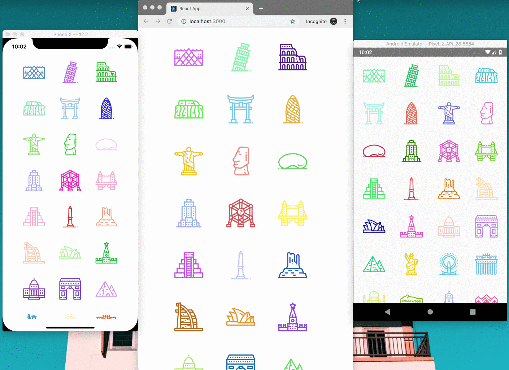
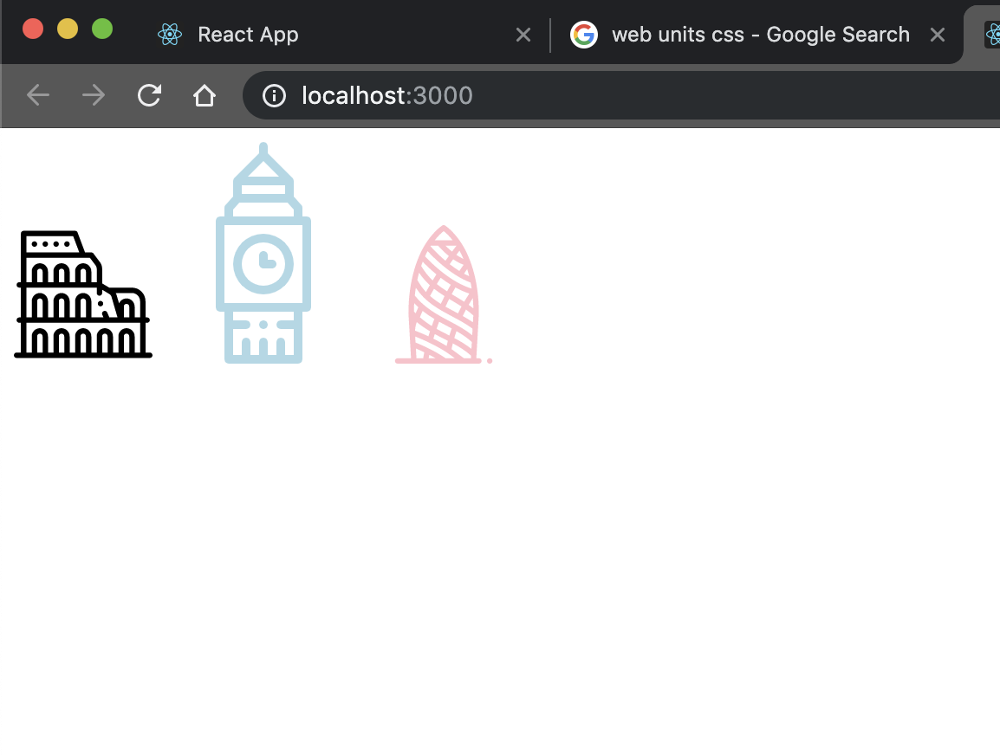
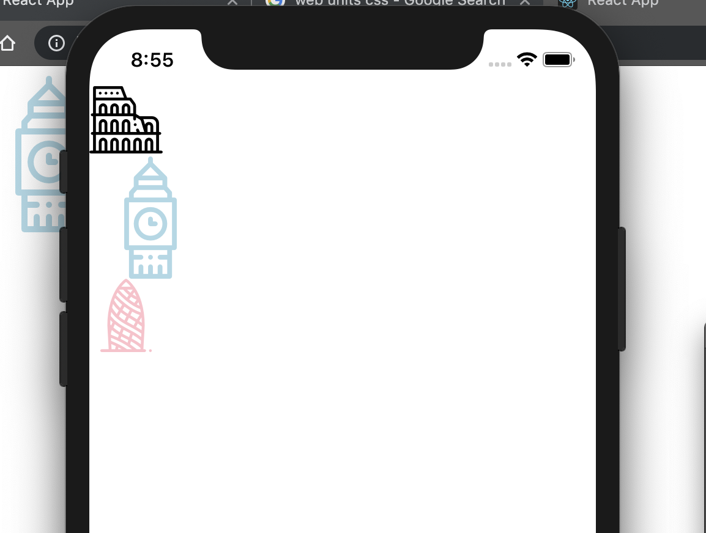

Implementing a maintainable icon system for a React and React Native can a hard task, specially when it comes to have the same workflow to add/remove/use an icon in web and native applications (Android/iOS). In this post, I'm going to share my experience of implementing a consisting icon system inside the component libraries of my company.

## The problematic 😞

If you come from a web background, it's well known that you can use the `<svg>` to directly render an `SVG` image into the DOM. This is perfect because browsers are prepared for that.

Sadly, this is not the same scenario for React Native ... First of all, the platform doesn't support rendering `SVG` directly and it seems this is going to stay like this for a while. You can follow this [feature request](https://react-native.canny.io/feature-requests/p/support-rendering-svg-images) for more information.

Therefore the workaround the community has created 3rd party libraries outside from React Native to deal with `SVG`. Some examples are: `react-native-svg`, `react-native-svg-uri`, `react-native-svg-asset-plugin`.

In summary, you can't use the same render in both platform (web and mobile), and also depending on the RN library you picked the API of your component will change. This can a problem when working with projects written in React and React Native where the main objective is to share as much code as possible. Therefore you need to look for a way to abstract all these implementation details.

## Proposed solution: Autogenerated Icons 👍

Let's set the example that you have all your in `SVG` format and inside an `assets` folder inside your repository. The normal workflow will be to create one component for web and another for mobile, using some abstraction for each one like `Icon.js` and `Icon.native.js`.

But what if you can automatize this process, so the only thing you need to do is adding/removing Icons from this `assets` folder. This is when generating Icons are quite helpful!

The generation of Icon components occurs right before starting and building the application, this is to ensure that they are always up to date. The result of it will be a file which exports all the icons as React Components, each of them will call the proper implementation in the respective platform.

At the same, both implementation will implement the same API (`propTypes`) making the icon system consistent between platforms and proving an excellent development experience.

## Demo time

I created a repository from which I extracted the snippets that are going to follow, so in case you want to skip the explanation and jump into the code I leave you the link.

<div class="Image__Medium">
  
  <figcaption>Final Demo</figcaption>
</div>

[Repo link](https://github.com/EmaSuriano/maintainable-icon-system-react.git)
[Live web demo](https://emasuriano.github.io/maintainable-icon-system-react/index.html)

## Time to code

<div class="Image__Small">
  
  <figcaption>Time to start</figcaption>
</div>

So let's start a clean project using `create-react-app` and `create-react-native-app`. After playing around a little bit I realized that it's easier to bootstrap the project using `create-react-native-app` and then add the missing files to the project.

```bash
create-react-native-app MaintainableIconSystemReact

create-react-app delete-me-later
```

Then inside the folder you need to add the `/public` folder with the `delete-me-later` project. Also, create the `assets` folder. For this demo I decided to use the collection of Icon called [`Landmarks and Monuments`](https://www.flaticon.com/packs/landmarks-and-monuments-18) from FlatIcon. Download the package and extract the icons inside the `assets` folder.

## Generating Icon Components

This will be the entry point for both platform, each `svg` icon inside the `assets` folder will be transform into a React component which will call the platform specific implementation (next two sections).

In summary this step should:

- Read the icons from the `assets` folder.
- For each icon create a React Component with the proper name and send the name of the original icon.
- Export as module the generated icons.

```javascript
const { readdirSync } = require('fs');

// some helpful functions
const isSVG = file => /.svg$/.test(file);
const removeExtension = file => file.split('.')[0];
const toPascalCase = string =>
  string
    .match(/[a-z]+/gi)
    .map(word => word.charAt(0).toUpperCase() + word.substr(1).toLowerCase())
    .join('');

// getting all the icons
const icons = readdirSync(ICON_SOURCE_FOLDER)
  .filter(isSVG)
  .map(removeExtension);

const indexContent = [
  "import React from 'react';",
  "import Icon from './Icon';",
  '',
  icons
    .map(
      icon =>
        `export const ${toPascalCase(
          icon,
        )} = props => <Icon {...props} name="${icon}" />;`,
    )
    .join('\n'),
].join('\n');

writeFileSync(`src/components/Icon/index.js`, indexContent);
console.log('Icon component file created! ✅');
```

The result of this script should be an `index.js` file located inside `src/components/Icon` which should look similar to:

```javascript
import React from 'react';
import Icon from './Icon';

export const Louvre = props => <Icon {...props} name="001-louvre" />;
export const LeaningTowerOfPisa = props => (
  <Icon {...props} name="002-leaning tower of pisa" />
);
export const Coliseum = props => <Icon {...props} name="003-coliseum" />;
// and the rest of the icons
```

## Implementing Web Abstraction 🖥

As I said in the introduction, the web is already prepared to render `SVG`, the only thing you need to solve is how your project will load then. Otherwise when you try to run your project it will throw an exception because it doesn't know how to handle this type of files.

As I decided to use as a base project `create-react-app` it has already integrated an svg loader inside its hidden webpack configuration. The way this works is by exporting a `ReactComponent` in the `import` of the `svg`, which will display the proper icon. For example:

```javascript
import { ReactComponent } from './my-awesome-icon.svg';

const MyApp = () => (
  <div>
    <p>This is my awesome icon!</p>
    <ReactComponent />
  </div>
);
```

So for this step the only task you need to do is to aggregate all the icons inside a map which then can be used in the `Icon.js` component. In order do you can use the following snippet:

```javascript
const iconMapContent = [
  icons
    .map(
      icon =>
        `import { ReactComponent as ${toPascalCase(
          icon,
        )} } from './${icon}.svg';`,
    )
    .join('\n'),
  '',
  'export default {',
  icons.map(icon => `"${icon}": ${toPascalCase(icon)}, `).join('\n'),
  '};',
].join('\n');

writeFileSync(`src/assets/icons/icon-map.js`, iconMapContent);
console.log('Web Icon Map created! ✅');
```

The result of it will be a file called `icon-map.js` inside the `assets/icons` folder with all the _special_ import to get the React Component from the `svg` and then exports all of them in a map with key as the name of the originalFile.

```javascript
import { ReactComponent as Louvre } from './001-louvre.svg';
import { ReactComponent as LeaningTowerOfPisa } from './002-leaning tower of pisa.svg';
import { ReactComponent as Coliseum } from './003-coliseum.svg';

// and the list continues ...

export default {
  '001-louvre': Louvre,
  '002-leaning tower of pisa': LeaningTowerOfPisa,
  '003-coliseum': Coliseum,
};
```

The last thing to do is create the `Icon` component for web. The idea behind this component is to standarize the `props` between Web and Native, this will make the use of the component platform agnostic which will save a lot of time when developing!

For this example the shared props between platform are:

- `name`: The name of _file_ of the icon. This prop is specified by the `Icon/index.js` when you import a specific Icon.
- `size`: How big it will be, also here you can set the default size of it.
- `color`: The general color of it, by default will be black.

```javascript
import React from 'react';
import iconMap from 'assets/icons/icon-map';

const Icon = ({ name, size, color, ...rest }) => {
  const Icon = iconMap[name];
  return <Icon color={color} style={{ width: size, height: size }} {...rest} />;
};

Icon.propTypes = {
  name: PropTypes.string.isRequired,
  size: PropTypes.oneOfType([PropTypes.string, PropTypes.number]),
  color: PropTypes.string,
};

Icon.defaultProps = {
  size: '5em',
  color: 'black',
};

export default Icon;
```

## Implementing Native Abstraction 📱

One of the most performant approaches inside the react native world is treating your icons as a custom font, and then when you need to render an icon it will just a `Text` tag with a special character and using this custom font. So the order of steps will be:

1. Generate the custom font with the map of characters.
2. Load it inside our application.
3. Create the `Icon.native.js`.

In order to group all the icons inside a single font file you should install `icon-font-generator` which given a path it will generate:

- The `.ttf` file with all the fonts included.
- The `Glyph map`, which is a map that has keys as the name of the icon and values equals to the character/position of it inside the font.

There is a little hack you might to do the generated `Glyph map` because the values of each icon is expresed in Hexa and React Native has problem to read it. The simple solution is to parse the value to decimal.

```javascript
execSync(
  `icon-font-generator ./src/assets/icons/*.svg -o ./src/assets/fonts -n custom-font-icon -c false --html false --types ttf`,
);

const glyphMap = JSON.parse(
  readFileSync(`./src/assets/fonts/custom-font-icon.json`),
);

const customFontContent = [
  '{',
  icons
    .map(value => `"${value}": ${parseInt(glyphMap[value].substr(1), 16)}`)
    .join(',\n'),
  '}',
].join('\n');

writeFileSync(`./src/assets/fonts/custom-font-icon.json`, customFontContent);
console.log('React Native Asset generated! ✅');
```

The output of this script will generate the already mentioned files inside the folder `assets/fonts`. The next step is to load it inside your application.

If you are using a project with `create-react-native-app`, you need to set the folder of `assets/fonts` as a resource folder for the native projects. To do that, first add the following property to your `package.json`:

```json
{
  "rnpm": {
    "assets": ["./src/assets/fonts/"]
  }
}
```

And then execute the command of `react-native link` inside the root of your project, which will change the configuration of Android and iOS project and load the font when the application starts!

The last step of this implementation is creating the `Icon.native.js` which has to make use of the generated font and render the proper Icon. For that, I suggest using `react-native-vector-icons` which will do all the magic for us! The two things it needs is:

- The name of the font.
- The `Glyph map` that has been generated in the first step.

Also here you need to maintain the same `props` as in the web implementation, with the only consideration to change the defualt value of `size` because Native applicaitons can't handle web units (`px`, `em`, `pt`). Therefore the resulting code will be something like this:

```javascript
import customFontGlyph from '../../assets/fonts/custom-font-icon.json';
import { createIconSet } from 'react-native-vector-icons';

const Icon = createIconSet(
  customFontGlyph,
  'custom-font-icon',
  'custom-font-icon.ttf',
);

Icon.propTypes = {
  name: PropTypes.string.isRequired,
  size: PropTypes.oneOfType([PropTypes.string, PropTypes.number]),
  color: PropTypes.string,
};

Icon.defaultProps = {
  size: 60,
  color: 'black',
};

export default Icon;
```

## Rendering the icons 🎉

As the components held the same `props` the implemntation for both platform is almost identical, the differences are the values for `size` and the event handlers.

### Web implemntation

```javascript
import ReactDOM from 'react-dom';
import React from 'react';
import { Coliseum, BigBen, Gherkin } from './components/Icon';

const App = () => (
  <div>
    <Coliseum />
    <BigBen
      color="lightblue"
      size="8em"
      onClick={() => alert('This is the event handler')}
    />
    <Gherkin color="pink" />
  </div>
);

ReactDOM.render(<App />, document.getElementById('root'));
```

<div class="Image__Medium">
  
  <figcaption>Demo React</figcaption>
</div>

### React Native implemntation

```javascript
import React from 'react';
import { SafeAreaView } from 'react-native';
import { Coliseum, BigBen, Gherkin } from './components/Icon';

const App = () => (
  <SafeAreaView>
    <Coliseum />
    <BigBen
      color="lightblue"
      size={100}
      onPress={() => alert('This is the event handler')}
    />
    <Gherkin color="pink" />
  </SafeAreaView>
);

export default App;
```

<div class="Image__Medium">
  
  <figcaption>Demo React Native</figcaption>
</div>

## Last words 👋

It may seems like a lot of steps but once you have it in place this process will allow to easily add/remove/change icons without worrying about how they are going to be manipualate because they are going to be always React Components.

One last tip, I really suggest to run this generation before every `start` or `build` process, by doing this you will ensure that all the icons placed inside the `assets` have the respective React and React Native component.
