There is no doubt that Typescript has gained a huge adoption on the JavaScript ecosystem, and one of the great benefits it provides is the type checking of all the variables inside our code. It will check if performing any operation on a variable is possible given its type.

I gave a talk about the same topic in the Typescript Meetup of Berlin. This article and the talk cover the same content, so you pick any of them to learn about this topic!

<div class="Image__Medium">
    <YouTube videoId="cn6i5Av-B8Q" opts={{"start":"1884"}} />
  <figcaption>Link to the talk</figcaption>
</div>

Most of the people think that by using Typescript as their application language, they are "covered" from any emptiness error, like the classic _"undefined is not a function"_ or my favorite _"can't read property X of undefined"_.

This assumption is wrong, and the best way to demonstrate it is with code!

# Why will Typescript NOT always cover you? 🕵

The following example does **not** present any Typescript error.

```javascript
// Typescript definition
type ExampleType = {
  name: string,
  age?: number,
  pets: {
    name: string,
    legs: number,
  }[],
};

// communicates with external API
const fetchData = (): Promise<ExampleType> => {};

const getBiped = async () => {
  const data = await fetchData();
  console.log(data);
  // { name: 'John' }
  return data.pets.find((pet) => pet.legs === 2); // Boom!
};
```

The snippet contains:

- `ExampleType`: A type definition with two properties required `name` and `pets`, and one optional `age`. The property `pets` is an array of objects with `name` and `legs`, both required.
- `fetchData`: A function to retrieve data from an external endpoint.
- `getBiped`: Another function that will call `fetchData` and then iterate over the `pets`, and return only the `pets` with two `legs`.

So, why my script will fail when I execute it? The reason is, the external API is returning an object which doesn't contain `pets` inside, and then when you try to execute `data.pets.find()`, you will receive the error of `Uncaught ReferenceError: Cannot read property 'find' of undefined`.

Inside the [React official Documentation](https://reactjs.org/docs/static-type-checking.html) you can find a very nice definition of what Typescript is:

> TypeScript is a programming language developed by Microsoft. It is a typed superset of JavaScript and includes its compiler. Being a typed language, TypeScript can catch errors and bugs at build time, long before your app goes live.

Given that definition, it's possible to formulate a new assumption:

> Typescript performs static type validation. Developers should take of dynamic validations.

So then: _Do you need to validate everything? 🤔_

Simply, **No** 🎉

Checking all the variables of our application is time-consuming from a development and performance perspective. A nice rule of thumb you can follow is:

> Validate all the **external** sources of your application.

External sources are everything that it's external or doesn't have access to your application. Some examples:

- APIs responses
- Content inside files
- Input from the user
- Untyped Libraries

An application will always present at least one external source, otherwise, it will be very useless. Therefore, let's take a look at how you can write validations for your object in Typescript.

To keep things simple, the original snippet will be considered the _base_ and on top, I will show how to implement each of the Validation Methods.

---

## Manual Validation 👷‍♂️

Most basic validation, it's a set of conditions that check if the structure is the expected one.

```typescript
const validate = (data: ExampleType) => {
  if (!data.pets) return false;
  // perform more checks

  return true;
};

const getBiped = async () => {
  const data = await fetchData();
  console.log(data);
  // { name: 'John' }

  if (!validate(data))
    throw Error('Validation error: data is not complete ...');

  return data.pets.find((pet) => pet.legs === 2);
};
```

As you can see a new function has been defined, called `validate`, which receives as a parameter an `ExampleType` object, with which is going to check if the property `pets` is defined or not. In case not, it will return `false`, which will end up throwing an Error with a description message. Otherwise, it will continue the execution and now when evaluating `data.pets.find`, it won't throw an error.

Be aware that the implementation that the `validate` function is quite simple, and there is room for many more checks, such as:

- `name` should exist
- `name` should be a `string`
- if `age` exists, it should be a `number`.
- `pets` should be an `array` of `object`.
- each `pet` Object should have a property `name` and `legs`.

The more checks you add, the more robust your application will be, but the more time you need to invest too.

The advantages of this method are:

- **No external library required**: only pure Typescript.
- **Business-centric**: you can add any business logic inside these validators, for example, you can check that `propertyA` shouldn't exist if `propertyB` is present.

It also presents some disadvantages:

- **Manual work**: every validation has to be manually coded and this can be quite time-consuming.
- **Duplication of code**: in the example, `ExampleType` already defines that there is a `pets` property and that it is required, but again inside the validation code you should still check that it's true.
- **Room for bugs**: in the previous code, there were many "bugs" or places for improvement.

---

## Using a Validation Library ✨

Why re-inventing the wheel, right? This method consists of using any validation library to assert the structure of the objects. To name some of the most used libraries:

- [`ajv`](https://github.com/ajv-validator/ajv)
- [`joi`](https://github.com/hapijs/joi)
- [`v8n`](https://github.com/imbrn/v8n)
- [`validate.js`](https://github.com/ansman/validate.js)

The validation library used for this article is `ajv`, nevertheless, all the conclusions also apply to the other libraries.

```typescript
const Ajv = require('ajv');
const ajv = new Ajv();

const validate = ajv.compile({
  properties: {
    name: {
      type: 'string',
      minLength: 3,
    },
    age: { type: 'number' },
    pets: {
      type: 'array',
      items: {
        name: {
          type: 'string',
          minLength: 3,
        },
        legs: { type: 'number' },
      },
    },
  },
  required: ['name', 'pets'],
  type: 'object',
});

const getBiped = async () => {
  const data = await fetchData();
  console.log(data);
  // { name: 'John' }
  if (!validate(data)) {
    throw Error('Validation failed: ' + ajv.errorsText(validate.errors));
    // Error: Validation failed: data should have required property 'pets'
  }

  return data.pets.find((pet) => pet.legs === 2);
};
```

Many validation libraries force you to define a `schema` where you can describe the structure to evaluate. Given that schema, you can create the validation function which is going to be used in your code.

The declaration of your schema will always depend on the library you are using, therefore I always recommend checking the official docs. For the case of `ajv`, it enforces you to declare in an Object Style, where each property has to provide the `type` of it and, also, it's possible to set custom checker for these values, like `minLength` for any `array` or `string`.

This method provides:

- **A standardized way to create validators and checks**: the idea behind the `schema` is to have only **one** way to check for specific conditions inside your application. Especially in JavaScript where there are many ways to accomplish the same task, such as checking the `length` of an array. This quality is great to improve communication and collaboration inside a team.
- **Improvement of Error Reporting**: in case there is a mismatch on some property the library will inform you which one is the property in a human-friendly way, rather than just printing the Stack Trace.

This new way of creating validations present the following drawbacks:

- **Introduction of new Syntax**: when a team decides to add a new library, the difficulty degree to understand the whole codebase grows too. Every contributor has to know about the validator schema to understand how to make a change on it.
- **Validators and Types are not in Sync**: the definition of the `schema` and `ExampleType` are disconnected, which means that every time you make a change inside the `ExampleType`, you have to manually reflect it inside the `schema`. Depending on how many validators, you have this task can be quite tedious.

One small comment regarding keeping in Sync Validators and Types, some open-source projects address this issue, such as [json-schema-to-typescript](https://www.npmjs.com/package/json-schema-to-typescript), which can generate a Type definition from an existing Schema. Then this won't be considered a problem.

---

## Dynamic Types Validator 🔌

This is the method I want to talk about, and it presents a change of paradigm regarding how to create Validators and keep Types in sync.

In the two other methods, the Validator and the Type can be seen as different entities. The Validator will take the incoming Object and check its properties, and the Type statically belongs to the Object. Combining both entities, the result is a **Validated Types Object**.

<div class="Image__Small">
  
  <figcaption>Before</figcaption>
</div>

The method of Dynamic Types Validator allows a Type to generate a validator from his definition. Now they have are related, where a Validator depends entirely on a Type, preventing any mismatch between structures.

<div class="Image__Small">
  
  <figcaption>Now</figcaption>
</div>

---

### Generation of Validators 🤖

To generate these Validators, I found an amazing Open Source project called [`typescript-json-validator`](https://github.com/ForbesLindesay/typescript-json-validator), made by [@ForbesLindesay](https://twitter.com/ForbesLindesay). The description of the repository is:

> Automatically generate a validator using JSON Schema and AJV for any TypeScript type.

For the test, lets re-use the `ExampleType` definition, which now has been moved to a separate file inside the `types` folder.

```typescript
// src/types/ExampleType.ts

type ExampleType = {
  name: string;
  age?: number;
  pets: {
    name: string;
    legs: number;
  }[];
};
```

This library exposes a handy CLI that can be called from anywhere, and given a file path and the name of the Type, it will generate in the same location as the file a new file with the Validator code.

```bash
> npx typescript-json-validator src/types/ExampleType.ts ExampleType
# ExampleType.validator.ts created!
```

The resulting validator can be a very long file, so let's take a look piece by piece:

### 1. Creating the instance of `ajv`

It also sets some default configuration for `ajv`.

```typescript
/* tslint:disable */
// generated by typescript-json-validator
import { inspect } from 'util';
import Ajv = require('ajv');
import ExampleType from './ExampleType';

export const ajv = new Ajv({
  allErrors: true,
  coerceTypes: false,
  format: 'fast',
  nullable: true,
  unicode: true,
  uniqueItems: true,
  useDefaults: true,
});

ajv.addMetaSchema(require('ajv/lib/refs/json-schema-draft-06.json'));

export { ExampleType };
```

### 2. Definition of the `schema` from the Type

This is the key of this approach.

```typescript
// Definition of Schema
export const ExampleTypeSchema = {
  $schema: 'http://json-schema.org/draft-07/schema#',
  defaultProperties: [],
  properties: {
    age: {
      type: 'number',
    },
    name: {
      type: 'string',
    },
    pets: {
      items: {
        defaultProperties: [],
        properties: {
          legs: {
            type: 'number',
          },
          name: {
            type: 'string',
          },
        },
        required: ['legs', 'name'],
        type: 'object',
      },
      type: 'array',
    },
  },
  required: ['name', 'pets'],
  type: 'object',
};
```

### 3. Export validation function using the generated `schema`

It takes care also of throwing an Exception in case there is an error.

```typescript
export type ValidateFunction<T> = ((data: unknown) => data is T) &
  Pick<Ajv.ValidateFunction, 'errors'>;
export const isExampleType = ajv.compile(ExampleTypeSchema) as ValidateFunction<
  ExampleType
>;

export default function validate(value: unknown): ExampleType {
  if (isExampleType(value)) {
    return value;
  } else {
    throw new Error(
      ajv.errorsText(
        isExampleType.errors!.filter((e: any) => e.keyword !== 'if'),
        { dataVar: 'ExampleType' },
      ) +
        '\n\n' +
        inspect(value),
    );
  }
}
```

To use the validator, you just need to import from the respective path and call it. Be aware that this function is already checking if there were any errors inside the object, therefore it's not needed to add an `if` statement here, making the code much cleaner.

```typescript
import validate from 'src/types/ExampleType.validator';

const getBiped = async () => {
  const data = validate(await fetchData());

  return data.pets.find((pet) => pet.legs === 2);
};
```

### Typescript ❤️ Ajv

This library uses `ajv` under the hood to create the Validator function, which means that you can make use of all nice features it provides, such as custom validation for types.

Let's create a new definition type for `ExampleType`.

```typescript
interface ExampleType {
  /**
   * @format email
   */
  email?: string;
  /**
   * @minimum 0
   * @maximum 100
   */
  answer: number;
}
```

Above each property you find some annotations made inside comments bracket, these will be translated into `ajv` rules when the library generates the final Schema. This is the result:

```typescript
export const ExampleTypeSchema = {
  $schema: 'http://json-schema.org/draft-07/schema#',
  defaultProperties: [],
  properties: {
    answer: {
      maximum: 100,
      minimum: 0,
      type: 'number',
    },
    email: {
      format: 'email',
      type: 'string',
    },
  },
  required: ['answer'],
  type: 'object',
};
```

The property `answer` presents now two more attributes that will check if the `number` is between 0 and 100. In the case of `email`, it will check if the `string` value belongs to a valid email address.

As these annotations are wrapped inside comments, they don't present any conflict with the Typescript compiler.

## Making it part of your workflow

This method is based on the idea that the developer will run the CLI command and generate the validators, otherwise, it exists the possibility that the schema was generated with an older version of the Type, and then it can present mismatches.

Fixing this issue is quite easy, you have to simply add a script that will be executed before your code will run. You can call it `prebuild` or `prestart`, and this is how your `package.json` can look like:

```json
{
  "scripts": {
    "prebuild": "typescript-json-validator src/types/ExampleType.ts ExampleType",
    "start": "yarn prebuild && ts-node start.ts",
    "build": "yarn prebuild && tsc"
  }
}
```

One last recommendation, I recommend ignoring any `validator.ts` file from your project, because there is no point in committing these files to your repository as they are going to be generated every time you start your project.

---

## My experience with this approach 🙋‍♂️

About 2 months ago, I open-sourced one of my side projects called [`gatsby-starter-linkedin-resume`](https://github.com/EmaSuriano/gatsby-starter-linkedin-resume).

In summary, it's a [Gatsby Starter](https://www.gatsbyjs.org/docs/starters/) that can retrieve your information from Linked In, using a [Linked In Crawler](https://github.com/linkedtales/scrapedin), and generate an HTML and PDF resume from it, using [JSON Resume](https://jsonresume.org/).

The project presents two main flows:

1. Create the resume information: you will be asked to enter your Linked In credentials, then a crawler will open a new browser, read your profile values and finally save all this information inside a JSON file in your directory. After that, the project will transform the data extracted from the crawler into the structure for Json Resume.
2. Build the project: once the resume information has been processed, Gatsby can generate HTML and PDF with it.

At the beginning of this article, I mentioned that it's advisable to validate your external sources. For this project they are:

1. **Data coming from the Linked-in crawler**: when dealing with crawlers you should always be very careful with their outcome because it's highly attached to the website that they are getting the data from. In case there is a change on the website, the output from the crawler can be altered.
2. **Local file with the resume information**: this project allows you to change the content of your resume manually, in reality in case you want to you can skip the creation of the resume information and create it by yourself. If the structure of the resume data is wrong, JSON Resume won't be able to generate the resume properly.

These are the Type definition for each case:

```typescript
interface LinkedInSchema {
  contact: ContactItem[];
  profile: ProfileData;
  positions: LinkedInPosition[];
  educations: LinkedInEducation[];
  skills: Skill[];
  courses: Course[];
  languages: LinkedInLanguage[];
  projects: LinkedInProject[];
}

interface JsonResumeSchema {
  basics: JsonResumeBasics;
  work: JsonResumeWork[];
  volunteer?: JsonResumeVolunteer[];
  education: JsonResumeEducation[];
  awards?: JsonResumeAward[];
  publications?: JsonResumePublication[];
  skills?: JsonResumeSkill[];
  languages?: JsonResumeLanguage[];
  interests?: JsonResumeInterest[];
  references?: JsonResumeReference[];
  projects?: JsonResumeProject[];
}
```

Both Types present similarities in terms of variable names, but their internal structure differs. This is why it's necessary to transform from one structure to the other on the first flow.

After I set up my project to generate the Validators from these types, checking the structure of the incoming object was a very easy task.

## Validation of the Crawler result

```typescript
// src/index.ts
import { RESUME_PATH, LINKED_IN_PATH } from './utils/path';
import validateLinkedInSchema from './types/LinkedInSchema.validator';
import { saveJson, readJson } from './utils/file';
import { inquireLoginData, getLinkedInData } from './utils/linkedin';

// ❗️❗️ IMPORT OF THE VALIDATOR  ❗️❗️
import mapLinkedInToJSONResume from './utils/mapLinkedInToJSONResume';

export const main = async ({ renew }) => {
  if (renew || !readJson(LINKED_IN_PATH)) {
    const credentials = await inquireLoginData();
    const linkedInData = await getLinkedInData(credentials);

    saveJson(LINKED_IN_PATH, linkedInData);
  }

  // ❗️❗️ VALIDATION IN ACTION ❗️❗️
  const linkedInParsed = validateLinkedInSchema(readJson(LINKED_IN_PATH));

  const jsonResumeData = mapLinkedInToJSONResume(linkedInParsed);
  saveJson(RESUME_PATH, jsonResumeData);
};
```

## Validation of the Resume Information

```javascript
// gatsby-config.js
const { existsSync } = require('fs');

// ❗️❗️ IMPORT OF THE VALIDATOR  ❗️❗️
const {
  default: validateJsonResume,
} = require('./lib/types/JsonResumeSchema.validator');

if (!existsSync('./resume.json')) {
  throw new Error(
    'Please run "yarn generate-resume" to generate your resume information.',
  );
}

// ❗️❗️ VALIDATION IN ACTION ❗️❗️
const resumeJson = validateJsonResume(require('./resume.json'));

module.exports = {
  plugins: [
    {
      resolve: 'gatsby-theme-jsonresume',
      options: {
        resumeJson,
      },
    },
    'gatsby-plugin-meta-redirect',
  ],
};
```

---

## Closing Words 🗣

To sump up, I created this table comparing the three methods, in which the Dynamic Types approach shows that it grabs the best of the other methods, making it the recommended approach to validate your object.

| Approach                  | Manual | Library | Dynamic Types |
| ------------------------- | ------ | ------- | ------------- |
| No additional Syntax      | ✅     | ❌      | ✅            |
| Validators and Types Sync | ❌     | ❓      | ✅            |
| Standardization           | ❌     | ✅      | ✅            |

In case you are working in a Typescript codebase, I recommend you to give a try to this new of validating your object. It's very easy to make the set up for it, and in case you don't find it useful removing from the codebase is as easy as removing an `import` from your files.
