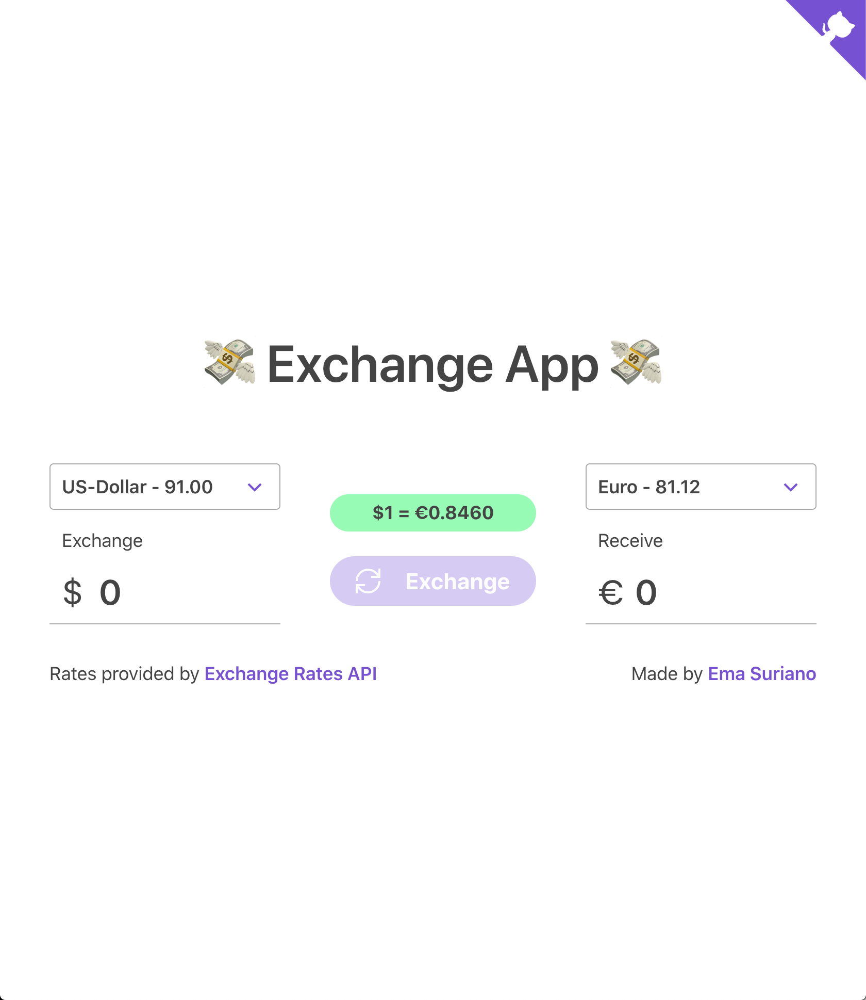

A new State Management Framework is realized, and the community is flooded with TODO lists. They are great example to understand the basics of how to use a tool, but it's quite hard to make it shine. In this post, I want to share the Exchange Application I built with Recoil which presents real-life challenges.

This year at the React Europe, the Facebook team shared their State Management which has been using for some of their internal applications but now it's finally Open Source! Its selling point is that it has designed around React. I recommend watching the record of the talk.

    <YouTube videoId="_ISAA_Jt9kI" opts={{"start":0}} />
  <figcaption>Recoil in React Europe 2020</figcaption>

You can give it a try to the application, which is already deployed and fully functional [here](https://emasuriano.github.io/exchange-app/). Also, in case all the code is open source and hosted in [Github](https://github.com/EmaSuriano/exchange-app).

  
  <figcaption>Demo Exchange App</figcaption>

## What does the application do?

In one sentence: _"Exchange Application based on Open Exchange Rate"_.

And in more details, it has all these features:

- Conversion between 3 different currencies: USD, EUR and GBP.
- Fetch Exchange Rate from [Open Exchange Rate](https://openexchangerates.org/)
- Save Pocket amount between sessions by using Local Storage API.

### Why this application is a better example than a TODO list? 🤔

- **State diversity and inter-communication**: The amount of different states to maintain is higher and they present a high interaction between them (read/write operations). I am going to go into more details when I talk about the state structure.
- **Network requests**: The application relays in an external source in order to make the computations. This feature is not covered inside TODO apps, and it's **always** present in any web application.
- **Interaction with the Browser APIs**: on every confirmed transaction the applications saves the value of each pocket, and they are retrieved in case the user comes back to the site. This process is commonly known as restoration of state, and it's present in all the web application. Some TOO apps implement this feature.

### Some clarifications before start ...

The way this post is going to work is by covering the features, focusing on understanding how the pieces are connected and not much on the implementation details. On every step, I will include links to the mentioned file, therefore you can always check the full implementation by yourself.

I documented some technical aspects of the application, such as tecnologies used, CI/CD process and development process inside the [README.md](https://github.com/EmaSuriano/exchange-app/blob/master/README.md) of the repository. If you want to code your own Exchange Application, I highly recommend going through it.

After saying that, time to start!

  
  <figcaption>Getting Ready</figcaption>

## A quick recap of Recoil 📚

This framework can be splitted into two concepts:

- Atoms: EXPLAIN_THIS
- Selector: EXPLAIN_THIS

You can read more about these [core concepts](https://recoiljs.org/docs/introduction/core-concepts) in the official documentation of Recoil.

## Implementing the conversion between pockets

- Identify the atoms that are included in the operation
-

## References 📖

- [Github Repository](https://github.com/EmaSuriano/exchange-app)
- [Demo](https://emasuriano.github.io/exchange-app/)
- [Recoil Documentation](https://recoiljs.org/docs/introduction/getting-started)
