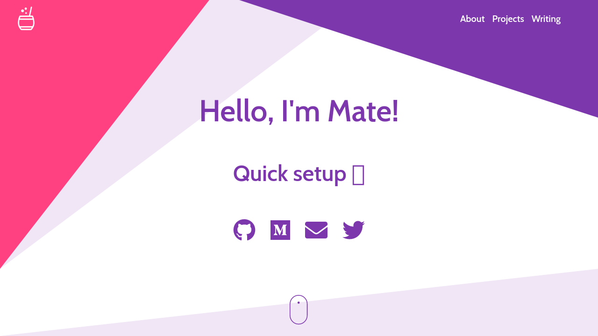
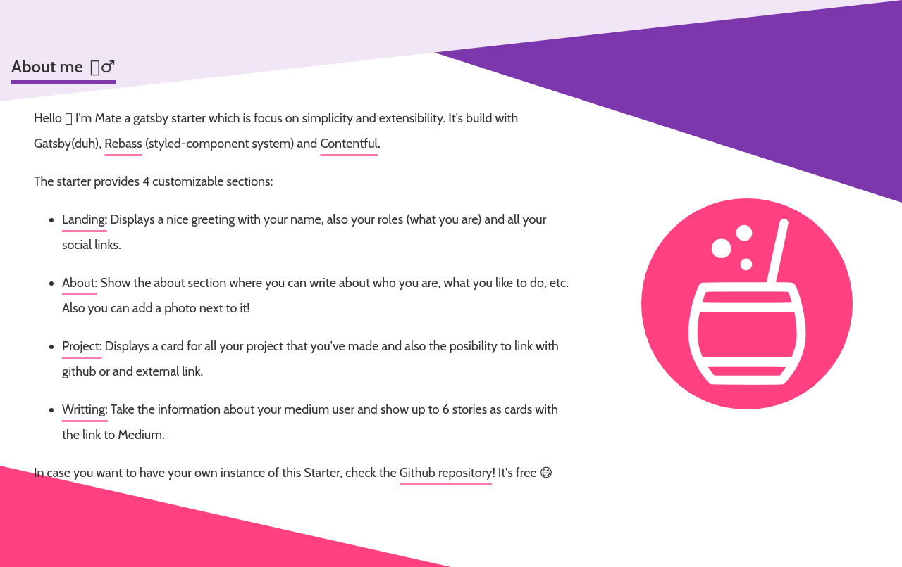
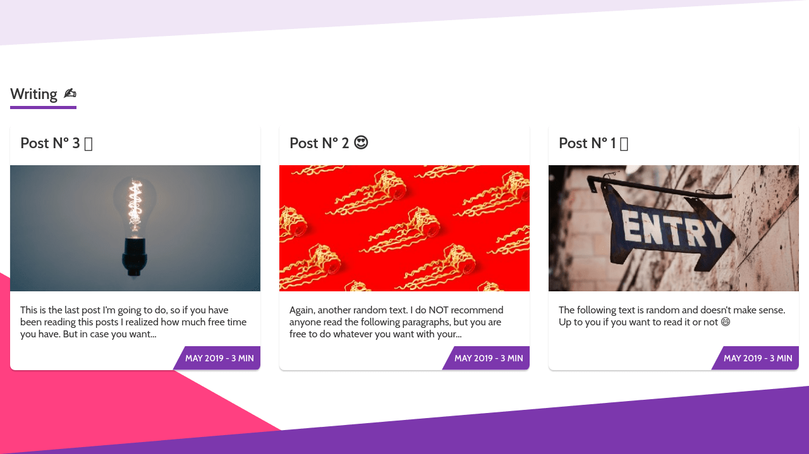

One of my favorite ways to document projects is by adding screenshots of how it looks, to provide a quick overview of what it does and looks like. Sadly these images are quite easy to get out-dated and I was being forced to manually update them ... In this post, I want to share the workaround I came up, to make this process autonomous by using Cypress and Github Actions.

## My Case in Particular

I am the owner and maintainer of the [Gatsby Starter Mate](https://github.com/EmaSuriano/gatsby-starter-mate), which allows developers or tech writers to bootstrap their own portfolio and manage its content with a CMS.

Nevertheless one can always open the Demo website and navigate though it, I decided to create a simple Table where I show how each of the sections looks like. This is the table extracted from the [README.md](https://github.com/EmaSuriano/gatsby-starter-mate/blob/master/README.md).

| Section  |                      Screenshot                       |
| -------- | :---------------------------------------------------: |
| Home     |       |
| About me |     |
| Projects |  |
| Writing  |    |
| 404      |            |

As I highlighted at the beggining of this post, in case I made a change in the UI: CSS change, content change, add/remove new components, etc. I had to regenerate these screenshots ... The process was as it follows:

1. Start the development server.
2. Open the website in the browser (trying to always use the same window size).
3. Take screenshot and store in the repository.
4. Remove old image and rename new image with the old one.

Besides the process was not hard to execute it, I had to repeat it for each of the sections and sometimes I was simply forgetting to do it after I made a change.

It's time to bring the machines to the play! 🤖

<div class="Image__Small">
  
  <figcaption>Time to automate</figcaption>
</div>

## Setting up Cypress

[Cypress](https://www.cypress.io/) is a Javascript End to End Testing which provides a nice framework to work with and it's capable of emulating a browser which can interact with any website by using the browser APIs.

Nevertheless this tool was created in mind of doing Testing, you can use it as a _Photographer_, in order to make the Browser to take screenshots of your website and store them on your repository!

As this tool is not needed when we run our application in production, it's always recommended to install it as a development dependency:

```bash
# npm
> npm install cypress --save-dev

# yarn
> yarn add cypress --dev
```

Then you have to create a file called `cypress.json` located at the root of your directory, providing the url of your project:

```json
{
  "baseUrl": "http://localhost:3000/",
  "screenshotsFolder": "docs"
}
```

In case you provided a `localhost` route, you have to ensure that your development server is running on the background when Cypress is running.

Next, let's add a simple health check that will navigate to the Home Page of the project and check if the local server is answering correctly. For that create a file called `health.spec.js`, located inside a folder called `cypress/integration` at the root folder of the repository:

```javascript
// cypress/integration/health.spec.js

it('health test', () => {
  cy.visit('/');
});
```

After this you can finally execute Cypress by running:

```bash
> yarn cypress run
```

This command will create the folders of `plugins` and `support` inside Cypress folder with some boilerplate inside, which will come handy in the future steps.

## Taking screenshots with Cypress

Time to make Cypress take those screenshots! Let's start by adding a new file inside `integration` called `photographer.test.js`, with some basic tests:

```javascript
describe('Photographer', () => {
  beforeEach(() => {
    cy.viewport('macbook-15'); // Desktop viewport
  });

  // Taking screenshots by Sections
  it('Landing Section', () => {
    cy.visit('/');
    cy.get('#home').screenshot('Landing');
  });

  it('About Section', () => {
    cy.visit('/');
    cy.get('#about').scrollIntoView().screenshot('About');
  });

  // Taking screenshots of the whole page
  it('404 Page', () => {
    cy.visit('/');
    cy.get('#404').screenshot('404');
  });
});
```

The `url` of the pages to visit and `css` selectors may change depending on your project, but the idea will remain the same:

- Visit a particular route of your application.
- Use a `css` selector to pick a section or grab all the content.
- Take a screenshot using a **descriptive** name.

Once you are done with setting the routes and name of your section, run Cypress by executing `yarn cypress run`, and you will see a new folder called `screenshots` located at the root of your project with the screenshots taken by Cypress. Be aware that Cypress will remove and recreate this folder on every run, so don't worry if your images disappear between runs.

```tree
📦screenshots
 ┗ 📂photographer.test.js
   ┣ 🖼404.png
   ┣ 🖼About.png
   ┣ 🖼Landing.png
   ┣ 🖼Projects.png
   ┗ 🖼Writing.png
```

The last thing, is to change your documentation to point to these picture instead of the manual ones. I recommend creating a table for this, because it provides a very clear interface for the readers to visualize the pictures. This is the one I used:

```markdown
## Screenshot and Design 🖼

| Section  |                         Screenshot                         |
| -------- | :--------------------------------------------------------: |
| Home     |       |
| About me |     |
| Projects |  |
| Writing  |    |
| 404      |            |
```

## Automatizing (now for real) the pictures ...

Up to this point, we managed to make Cypress take the screenshots for us, but we still have the task to call it by running `yarn cypress run`, and also we had to make sure our development server is running at that time to generate valid screenshots.

In order to make sure Cypress will run when the development server is running, I recommend using the npm package called `start-server-and-test` which does exactly what is says: start any server, wait for a specific port to be open and finally run the test. It's very useful in these situations 👏

To install it, you can use either yarn or npm.

```bash
# npm
> npm install start-server-and-test --save-dev

# yarn
> yarn add start-server-and-test --dev
```

Then inside your `package.json`, you can add the following commands inside the `scripts` property:

```json
{
  "scripts": {
    "test": "cypress run",
    "start": "react-scripts start",
    "take-screenshots": "start-server-and-test 3000"
  }
}
```

In order to test it, you can simply execute the `take-screenshot` command and you should be able to see something like:

```bash
➜  my-project git:(master) ✗ yarn take-screenshots
yarn run v1.22.5
$ start-server-and-test 3000
1: starting server using command "npm run start"
and when url "[ 'http://localhost:3000' ]" is responding with HTTP status code 200
running tests using command "npm run test"

...
```

Alright, now we need something that will call this command automatically for us and push it into our Repository. This is when Github Actions comes into the Game (you can actually use any CI, but I find the implementation with Actions pretty simple and straight forward).

In order to enable Github Actions, you have to create a new _Workflow_ file located inside `.github/workflows` folder. You can name this file as you want, the only rule to follow is that it has to be a `yaml` file.

```yaml
# .github/workflows/update-docs.yml

# Workflow name
name: Update Docs

# Run on every push to master
on:
  push:
    branches: master

jobs:
  # Job name
  update-readme:
    # Environment setup
    runs-on: ubuntu-latest

    # job
    steps:
      - name: Checkout repository
        uses: actions/checkout@v2
      - name: Setup Node
        uses: actions/setup-node@v1
      - name: Install dependencies
        run: yarn install --frozen-lockfile
      - name: Take screenshots
        run: yarn take-screenshots
      - name: Commit screenshots
        uses: stefanzweifel/git-auto-commit-action@v4
        with:
          commit_message: Update Screenshots
```

Something I like about the Workflows from Github Actions is how descriptive they are. Basically it consists of:

- Name of the workflow, which serves as an identifier.
- When the Workflow will be triggered.
- What it will do once triggered, A.k.a jobs. Each Job has:
  - Unique identifier.
  - On which environment it will run.
  - Set of steps or commands to run whatever script you want to execute or any other github action called.

One of the best capabilities of Github Actions is the ability to compose actions. In the example from above, in order to commit the changes inside the screenshots I am using the `git-auto-commit-action` which will look at my changes and then perform a `git commit -am "commit_message"` into my repository.

In case you want to read more about Github Workflows, I recommend heading to the official [Github Documentation](https://docs.github.com/en/free-pro-team@latest/actions/reference/workflow-syntax-for-github-actions).

Finally, to test if your Workflow is working you have to push your changes into your `master` branch. Here you can see a normal execution I run inside [gatsby-starter-mate](https://github.com/EmaSuriano/gatsby-starter-mate/runs/1309156962).

## Taking it to the next level 🚀

In case you have noticed inside the `photographer.test.js` file, I had to type the name of my routes and the selectors that I wanted to use. But what if, I can also automate this process? 🤔

**DISCLAIMER:** this is just an idea that I didn't implement yet but I think it's totally doable given the current technologies we have nowadays.

The first step will be to collect all the routes inside our application. This will change depending on the technology and routing you have picked. But from here you should produce a file called `routes.json` with the list of all the routes.

Next, you have to store this file inside `cypress/fixtures` folder, so then Cypress can have access to it inside the `photographer.test.js` file:

```javascript
describe('Photographer', () => {
  const routes = require('../fixtures/routes.json');

  beforeEach(() => {
    cy.viewport('macbook-15'); // Desktop viewport
  });

  routes.forEach((route) => {
    it(`${route}`, () => {
      cy.visit('/');
      cy.get('#shared-section-id').screenshot(route);
    });
  });
});
```

Finally, you have to generate the table based on the `routes.json` file or from the generated images. In this case, I will do it from the file, but in both cases the output should be the same.

```javascript
// generate-docs-readme.js

const main = async () => {
  const routes = require('./cypress/fixtures/routes.json');

  const routeToTable = (route) =>
    `| ${route} |  |`;

  const content = [
    '## Pages Screenshots',
    'Dynamic screenshots based on the last version deployed.',
    '| Page  | Screenshot |',
    '| --- | :---: |',
    ...routes.map(routeToTable),
  ];

  fs.writeFileSync('photographer.md', content.join('\n'));
};

main();
```

This idea can be improved in several ways:

- Expose specific `css` selectors depending on the screen, to have more accurate screenshots.
- Expose names of screens instead of treating them as routes.
- With the combination of the idea from above, your `routes.json` can tell Cypress to take more than one picture from a Page.

## Last Words

I had a ton of fun integrating these two tools and I think the result it's quite useful. I hope more people liked the idea and convinced them to try this approach to battle against out-dated documentation 😅

I nearly used all the potential from these two tools, I highly recommend to pass by though their official documentation: [Cypress Docs](https://docs.cypress.io) and [Github Actions Docs](https://docs.github.com/en/free-pro-team@latest/actions/reference/workflow-syntax-for-github-actions). They provide much more functionality inside.

Thanks for reading and let's keep building stuff together! 👷‍♂️

### References

- [Gatsby Starter Mate](https://github.com/EmaSuriano/gatsby-starter-mate)
- [Cypress Documentation Page](https://docs.cypress.io)
- [Github Actions Documentation](https://docs.github.com/en/free-pro-team@latest/actions/reference/workflow-syntax-for-github-actions)
- [Example Github Actions in Gatsby Starter Mate](https://github.com/EmaSuriano/gatsby-starter-mate/runs/1309156962)
