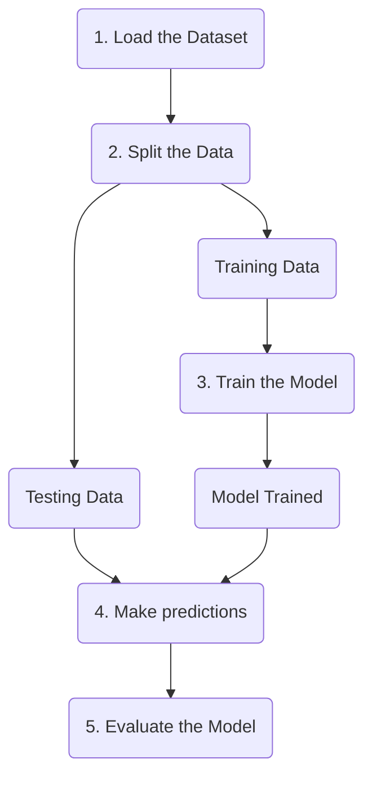

A couple of weeks ago I started venturing into Supervised Learning (yes, finally Machine Learning topics!), and to be fully honest the beginning was not the best for me. This was related to the amount of concepts and possible improvements that you can make to your model and data to improve the performance of your model. In this post, I want to cover the fundamentals, like building the most minimal model that can predict a value with a decent degree level.

Friendly advice: the idea of this post is to give a quick overview of what supervised learning means and how you can implement it. In case you want a more deep-dive explanation I would highly recommend this book: [Introduction to Machine Learning with Python](https://www.oreilly.com/library/view/introduction-to-machine/9781449369880/), by Andreas C. Müller & Sarah Guido.

## "Supervised" Learning

Let's start by understanding what we mean when we use the word _Supervised_ learning. Imagine you're teaching a child to identify different fruits. You show them apples, bananas, and oranges, telling them what each one is called. After seeing many examples, the child learns to recognize and name these fruits on their own. That's essentially what supervised learning does!

In supervised learning, we provide a computer algorithm with:

1. Input data (properties of fruits): called `features`
2. Correct labels for that data (the names of the fruits): called `target`

The algorithm then learns to make connections between the `features` and `target`. The main idea is that once the model is trained, it can make predictions or classifications on new, unseen data, that we don't know its `target`.

## Type of Supervised Learning

Depending on the type of our `target` value we have to split our problem-solving into two categories:

- **Regression**: when `target` is a number. This means that the values can be approximated because they are continuous.
- **Classification**: when `target` is a string or object. Normally it represents some kind of category, like the fruits.

Identifying what kind of problem we are dealing with is key. Some models are meant to be used for Regression and others for Classification (except some that can run in both cases...).

## Introducing your best learning library `scikit-learn`

[Scikit-learn](https://scikit-learn.org/) is an open-source toolkit that provides simple and efficient tools for data analysis and machine learning. It offers a consistent interface for a wide range of algorithms, making it easy to implement, compare, and deploy various machine-learning models.

It's also the standard when it comes to learning because it provides many helpers for most of the steps in the training of a model. It will be used throughout the whole post, and I will explain each function when the implementation of it arrives to keep engaged.

To install it, run the following command in your terminal:

```bash
> pip install scikit-learn
```

## Minimal Workflow for Supervised Learning

When one is venturing into a new topic, dealing with an overflow of information can be overwhelming and it can easily make you forget the final output of our system. This is why I want to share what the smallest workflow for Supervised Learning will look like to train a model with a decent performance.

> At the end of the post I would include extra steps that I **do** recommend to do when you are planning to run the model in production.

The process will be divided into 5 steps:

1. Load the Dataset
2. Split the Data
3. Train the Model
4. Make predictions
5. Evaluate the Model



> All the code for this workflow can be found in my deployed instance of Jupyter Lite: [Minimal Workflow Supervised Learning](https://emasuriano.github.io/jupyterlite/notebooks/index.html?path=minimal-workflow-supervised.ipynb)

### 1. Load our Dataset

Something that we **need** to train a model is **data** and when it comes to Supervised Learning, this data has to be **labeled**, which depending on the situation can be hard ... Luckily `scikit-learn` includes many datasets that we can load and start playing around.

For this quick example, I'm going to be using the [Wine dataset](https://scikit-learn.org/1.5/modules/generated/sklearn.datasets.load_wine.html), which includes 13 chemical features that describe different types of wine. This problem is a **Classification** problem where our `target` value is the type of wine that takes the value of: `0`, `1`, or `2`. This is very important to highlight because if we treat this as a Regression problem, we are inferring that the class `0` is closer to class `1` than `2`, which is not correct for this problem.

```python
# import for datasets
from sklearn.datasets import load_wine

ds = load_wine(return)

X = ds.data  # Features
y = ds.target  # Labels
```

By convention in the ML world, we call `X` to the features and `y` to the labels. This comes from the mathematical plots where we have a function (`f(x) = y`) and the result when we call it passing `x` will return the value for `y`.

> Tip: All the datasets from `scikit-learn` come with a very handy description that will elaborate on the meaning of the features and labels. To see it, you have to access the value of `DESCR` of the dataset.

```plain
Wine recognition dataset
------------------------

**Data Set Characteristics:**

:Number of Instances: 178
:Number of Attributes: 13 numeric, predictive attributes and the class
:Attribute Information:
 - Alcohol
 - Malic acid
 - Ash
 - Alcalinity of ash
 - Magnesium
 - Total phenols
 - Flavanoids
 - Nonflavanoid phenols
 - Proanthocyanins
 - Color intensity
 - Hue
 - OD280/OD315 of diluted wines
 - Proline
 - class:
 - class_0
 - class_1
 - class_2

:Summary Statistics:

============================= ==== ===== ======= =====
 Min   Max   Mean     SD
============================= ==== ===== ======= =====
Alcohol:                      11.0  14.8    13.0   0.8
Malic Acid:                   0.74  5.80    2.34  1.12
Ash:                          1.36  3.23    2.36  0.27
Alcalinity of Ash:            10.6  30.0    19.5   3.3
Magnesium:                    70.0 162.0    99.7  14.3
Total Phenols:                0.98  3.88    2.29  0.63
Flavanoids:                   0.34  5.08    2.03  1.00
Nonflavanoid Phenols:         0.13  0.66    0.36  0.12
Proanthocyanins:              0.41  3.58    1.59  0.57
Colour Intensity:              1.3  13.0     5.1   2.3
Hue:                          0.48  1.71    0.96  0.23
OD280/OD315 of diluted wines: 1.27  4.00    2.61  0.71
Proline:                       278  1680     746   315
============================= ==== ===== ======= =====

:Missing Attribute Values: None
:Class Distribution: class_0 (59), class_1 (71), class_2 (48)
:Creator: R.A. Fisher
:Donor: Michael Marshall (MARSHALL%PLU@io.arc.nasa.gov)
:Date: July, 1988
```

### 2. Split the Data

To train a model, we need to feed him with data so the model will learn the patterns of the data. But we cannot simply give the model the whole dataset, otherwise, it prevents us from performing a proper assessment of how well the model will perform in real-world applications. This is because if we check the model performance on already seen data, the performance will most probably be very high, but whenever we want to use the model with unseen data the performance might not be that great after all.

For this reason, we have to separate our data into two parts. This is called Hold-Out Method, where we split the dataset into a `training` set and a `testing` set:

- **Training Set**: This subset is used to fit the model.
- **Test Set**: data that the model hasn’t seen during training. It serves as a benchmark for evaluating the model’s performance.

Normally we we reserve 80% of the data for `training` and 20% for `testing`, but in some situations where you have a lot of data available reserving 20% for testing might be too much.

Sci-kit learn comes with a very handy function called `train_test_split` which helps us with this task. To use it we need to pass the features (`X`) and targets (`y`) to be split, along with some optional parameters such as `train_size` to determine the percentage of the training dataset and the `random_state` which works as a way to remove random behavior of the splitting process.

```python
from sklearn.model_selection import train_test_split


X_train, X_test, y_train, y_test = train_test_split(
 X, y, train_size=0.2, random_state=0
)
```

### 3. Train the Model

Now, we can initialize and train our ML model on the `training` data. In this case, we are going to use [RandomForestClassifier](https://scikit-learn.org/stable/modules/generated/sklearn.ensemble.RandomForestClassifier.html) which as the says is a Classifier algorithm, that uses Decision Tree inside (it's a bit more complex, but for now let's keep it simple).

```python
from sklearn.ensemble import RandomForestClassifier

model = RandomForestClassifier(random_state=0)
model.fit(X_train, y_train)

```

One of the best things about Sci-kit Learn is its consistency of interfaces along all the functions and helpers. This means that in case we want to use a different model, like a [Support Vector Machine](https://scikit-learn.org/dev/modules/generated/sklearn.svm.SVC.html) we just import the model and call the `fit` method. This becomes quite handy when one is looking for the most adequate model to solve the problem.

```python
from sklearn.svm import SVC

# Now using SVC
model = SVC(kernel='linear')
model.fit(X_train, y_train)
```

### 4. Make predictions

Once the model is trained, it's time to use the test data that we reserve at the beginning. In this case, the model will try to **predict** what kind of wine type given the characteristics of each wine.

```python
# Now using the test set to predict its target
y_pred = model.predict(X_test)
```

This will be our output when the model is running in production, so knowing if this is the correct answer is very important to understand how good our system is. Therefore the next step is key when building a model.

### 5. Evaluate the Model

Once you have your predictions there is a world of metrics available for you to try. One of the simplest is the **accuracy score**, which measures the proportion of correctly predicted instances out of the total instances.

As expected there is a function inside Sci-kit Learn called `accuracy_score` that allows you to simply compare the prediction (`y_pred`) against the real targets (`y_test`) that comes from the splitting that we did.

```python
from sklearn.metrics import accuracy_score

accuracy = accuracy_score(y_test, y_pred)

print(f"Accuracy: {accuracy:.2f}")
```

The output is:

```plain
Accuracy: 0.98
```

This means that our model has a 98% rate of successfully identifying the correct wine type. Which is already a very good score!

Because we are dealing with a classification problem, there is another type of evaluation to gain deeper insights into the model's performance, you can also use a **confusion matrix**. This matrix provides a detailed breakdown of the model’s predictions compared to the true labels, showing how many instances were correctly and incorrectly classified for each class.

```python
from sklearn.metrics import confusion_matrix
import seaborn as sns
import matplotlib.pyplot as plt

# Generate confusion matrix
cm = confusion_matrix(y_test, y_pred)

# Visualize the confusion matrix
plt.figure(figsize=(8, 6))
sns.heatmap(cm, annot=True, fmt="d", cmap="Blues")
plt.xlabel("Predicted Labels")
plt.ylabel("True Labels")
plt.title("Confusion Matrix")
plt.show()
```

The resulting graph is:


As we can see most of the types of wine were correctly predicted, with the exception that in one case the system predicted to be Wine type 2, but it was supposed to be 1.

## Going Further: Key Improvements in Supervised Learning

For this example, our workflow gave us very good results, but this might not be always the case. In most cases, we are not going to count on a "ready-to-train" Dataset, and we might have to work extra before training our model.

This process is called **Feature Engineering**, and it involves creating, transforming, or selecting relevant features from the data to improve model performance and predictive accuracy. It's a big topic to cover now, which is why I will tackle it in a separate post.

In most of the models, the developer can assign a set of options or parameters to customize certain aspects of the model. These options can greatly increase the performance of our model. Finding the best options to initialize our model is called **Hyperparameter Tuning**. For some algorithms, this is a must to have good results.

Lastly, in many situations, we don't know which model will be the best fit for our case, which is why it's always important to run a **Model Selection** process, before going live. This typically involves training several models, evaluating their performance, and choosing the one that performs best based on specific metrics. Model selection can also include hyperparameter tuning to optimize each model.

## Closing Thoughts

While the minimal workflow helps you get started with machine learning, adding techniques like cross-validation, feature scaling, and model selection can significantly improve your model’s performance and generalization to new data.

Remember, building successful models is an iterative process. Experimenting with different methods and refining your approach will lead to more reliable and effective machine-learning solutions.

Thanks for reading.
